# PML-327 Memristor TBPTT Benchmark Results

This note records the benchmark branch comparison between two APIs for
memristive truncated backpropagation through time.

The benchmark branch is `pml327-memristor-tbptt-benchmark`. Nothing in this
note was pushed when these results were collected.

## Compared APIs

### Blackbox bounded window

The layer owns the truncation policy:

```python
builder.add_memristive_ps(..., num_backprop_steps=k)
```

On this branch, `k` means the total differentiable forward window retained by
the memristor implementation. For example, `k=2` means the current forward and
one previous forward can receive gradient through the recurrent memristive
state.

### Manual loop

The layer keeps full recurrent history until the user detaches it:

```python
builder.add_memristive_ps(..., num_backprop_steps=None)
...
loss.backward()
layer.detach_memristive_state()
```

This is the PyTorch-style TBPTT loop: the user decides the sequence/chunk
boundary, calls `backward()`, then detaches the recurrent memristor state while
preserving its numerical value.

## Benchmark Setup

Command used for the larger sweep:

```powershell
.\.venv\Scripts\python.exe benchmarks\run_memristor_tbptt_api_comparison.py `
  --k 2 4 `
  --timesteps 12 `
  --batch-size 1 2 `
  --n-modes 6 8 `
  --n-photons 3 4 `
  --input-size 2 `
  --memristor-count 1 2 `
  --entangling-layers 2 `
  --repeats 1 `
  --warmups 0 `
  --json-output .benchmarks\pml327_memristor_tbptt_larger_modes_photons.json `
  --csv-output .benchmarks\pml327_memristor_tbptt_larger_modes_photons.csv `
  --plot-dir .benchmarks\pml327_memristor_tbptt_larger_modes_photons_figures
```

The synthetic circuit is closer to the intended use case than the first smoke
tests:

- one trainable entangling layer before the memristors;
- one or two memristive phase shifters;
- another trainable entangling layer after the memristors;
- angle encoding on non-memristor modes;
- Fock-space probability measurement;
- the same random seed, inputs, layer shape, and chunk size for blackbox and
  manual runs.

## Result Files

Structured outputs:

- `../.benchmarks/pml327_memristor_tbptt_larger_modes_photons.json`
- `../.benchmarks/pml327_memristor_tbptt_larger_modes_photons.summary.csv`
- `../.benchmarks/pml327_memristor_tbptt_larger_modes_photons.comparisons.csv`
- `../.benchmarks/pml327_memristor_tbptt_larger_modes_photons.runs.csv`

Figures:

- `../.benchmarks/pml327_memristor_tbptt_larger_modes_photons_figures/time_ratio_blackbox_over_manual.png`
- `../.benchmarks/pml327_memristor_tbptt_larger_modes_photons_figures/process_call_ratio_blackbox_over_manual.png`
- `../.benchmarks/pml327_memristor_tbptt_larger_modes_photons_figures/wall_time_by_api.png`
- `../.benchmarks/pml327_memristor_tbptt_larger_modes_photons_figures/process_calls_by_api.png`
- `../.benchmarks/pml327_memristor_tbptt_larger_modes_photons_figures/rss_peak_delta_by_api.png`
- `../.benchmarks/pml327_memristor_tbptt_larger_modes_photons_figures/python_alloc_peak_by_api.png`

## Summary

| k | Workloads | Blackbox/manual process call ratio | Blackbox/manual wall-time ratio | Max blackbox RSS delta | Max manual RSS delta |
|---:|---:|---:|---:|---:|---:|
| 2 | 16 | 1.50x | 1.01x to 1.56x, average 1.29x | 9.66 MiB | 0.05 MiB |
| 4 | 16 | 1.75x | 1.15x to 1.96x, average 1.66x | 12.29 MiB | 5.35 MiB |

Output checksums and input gradient norm sums matched between the two APIs for
all larger-sweep workloads:

- `output_checksum_abs_delta = 0.0`
- `input_grad_norm_sum_abs_delta = 0.0`

That means the benchmark is comparing equivalent numerical behavior for these
cases, not two different training objectives.

## Figure Discussion

### Wall-Time Ratio

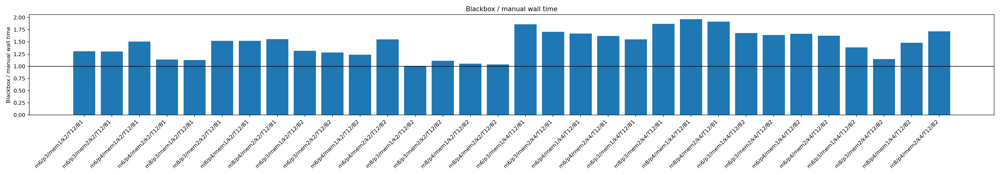

This is the most direct user-facing timing plot. Values above `1.0` mean the
blackbox API is slower than the manual loop.

The blackbox implementation is slower across the larger sweep. For `k=2`, the
ratio ranges from about `1.01x` to `1.56x`; for `k=4`, it ranges from about
`1.15x` to `1.96x`. The result is not perfectly proportional to the call ratio
because Perceval/PyTorch overheads and process memory state add noise, but the
trend is clear.

### Process Call Ratio

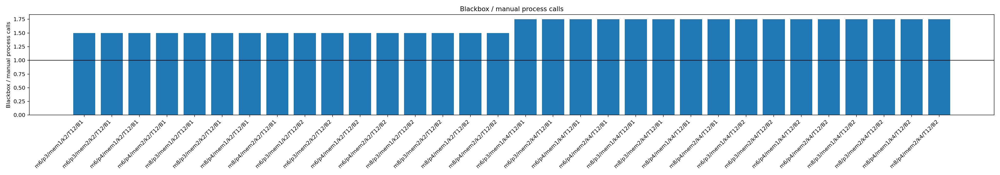

This is the cleanest performance signal because it counts calls into the layer's
underlying computation process.

For `T=12` timesteps:

- manual loop: `12` process calls;
- blackbox `k=2`: `18` process calls, ratio `1.50x`;
- blackbox `k=4`: `21` process calls, ratio `1.75x`.

The ratio is deterministic for these workloads. It confirms that the blackbox
approach performs extra circuit evaluations to rebuild or maintain the bounded
gradient window.

### Absolute Wall Time

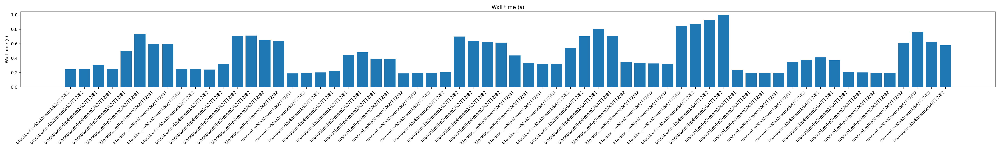

This figure shows the actual runtime for every workload/API pair. The larger
8-mode workloads are generally slower than the 6-mode workloads, as expected.
The blackbox bars are usually higher than the matching manual bars, but the
absolute gap depends on circuit size and batch shape.

The useful point is not one single timing number. The useful point is that the
manual loop keeps one quantum computation per timestep, while blackbox
truncation adds extra quantum computations as `k` grows.

### Process Calls By API

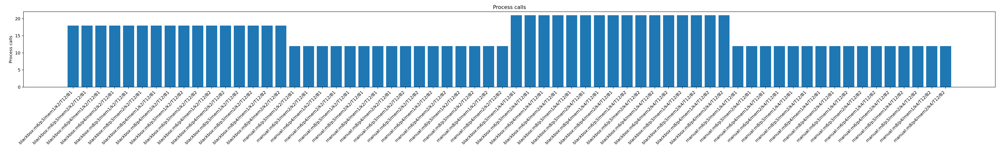

This is the absolute version of the process-call ratio plot. It shows that the
manual API remains fixed at one process call per timestep in this benchmark,
while blackbox `k=2` and `k=4` add extra calls.

This directly addresses the "two SLOS calls each time" concern: the blackbox API
does not preserve the one-forward-one-quantum-computation shape that a user loop
can preserve.

### RSS Peak Delta

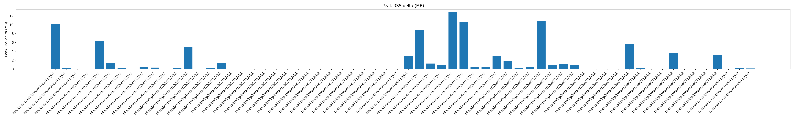

RSS is useful but noisy because it includes process-level allocator behavior,
PyTorch native allocations, and memory that may be retained by the process after
a run. It should not be interpreted as a precise per-layer memory allocation.

Still, the blackbox path often shows higher peak RSS deltas. This is consistent
with the implementation retaining graph fragments and doing additional
recomputation. The exact MiB values should be treated as directional unless we
run a more isolated profiler.

### Python Allocation Peak

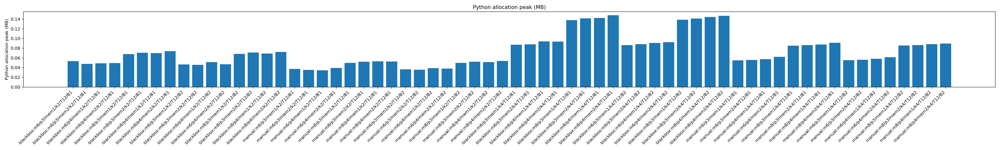

This uses `tracemalloc`, so it captures Python-level allocations but not all
native PyTorch/Perceval memory. It is therefore a complement to RSS, not a full
memory profile.

The blackbox path generally allocates more Python memory than the manual loop,
which matches the design: it stores and replays output fragments to reconstruct
the truncated differentiable window.

## Scaling Sweep

The initial benchmark only covered `k=2` and `k=4`. That is enough to expose the
extra-call mechanism, but it is not enough to show how the approach scales. I
therefore added line plots to `run_memristor_tbptt_api_comparison.py` and ran a
larger `k` sweep.

The new plots are more useful than the earlier bar charts because they keep one
variable on the x-axis while holding the other workload settings fixed.

### Broad Scaling Command

```powershell
.\.venv\Scripts\python.exe benchmarks\run_memristor_tbptt_api_comparison.py `
  --k 2 4 8 12 `
  --timesteps 16 `
  --batch-size 4 `
  --n-modes 4 6 8 `
  --n-photons 2 3 4 `
  --input-size 2 `
  --memristor-count 1 `
  --entangling-layers 2 `
  --repeats 1 `
  --warmups 0 `
  --json-output .benchmarks\pml327_memristor_tbptt_scaling_k_modes_photons.json `
  --csv-output .benchmarks\pml327_memristor_tbptt_scaling_k_modes_photons.csv `
  --plot-dir .benchmarks\pml327_memristor_tbptt_scaling_k_modes_photons_figures
```

Result files:

- `../.benchmarks/pml327_memristor_tbptt_scaling_k_modes_photons.json`
- `../.benchmarks/pml327_memristor_tbptt_scaling_k_modes_photons.summary.csv`
- `../.benchmarks/pml327_memristor_tbptt_scaling_k_modes_photons.comparisons.csv`
- `../.benchmarks/pml327_memristor_tbptt_scaling_k_modes_photons.runs.csv`

### Broad Scaling Summary

| k | Workloads | Blackbox/manual process call ratio | Blackbox/manual wall-time ratio |
|---:|---:|---:|---:|
| 2 | 9 | 1.50x | 0.79x to 2.09x, average 1.42x |
| 4 | 9 | 1.75x | 1.24x to 2.25x, average 1.62x |
| 8 | 9 | 1.875x | 1.25x to 1.92x, average 1.70x |
| 12 | 9 | 1.875x | 1.15x to 2.67x, average 1.85x |

The process-call ratio is deterministic for this benchmark and gives the clean
scaling signal. For `T=16`, the manual loop does `16` process calls. The
blackbox path does:

- `k=2`: `24` calls;
- `k=4`: `28` calls;
- `k=8`: `30` calls;
- `k=12`: `30` calls.

The ratio saturates for larger `k` because, with fixed `T=16`, the blackbox path
is already close to the maximum pattern of one base process call plus one extra
process call for almost every step inside a chunk. In other words, increasing
`k` beyond a certain point cannot add much more than "nearly one extra quantum
process call per timestep" for this sequence length.

As before, output checksums and input gradient norm sums matched exactly in the
scaling runs:

- `output_checksum_abs_delta = 0.0`;
- `input_grad_norm_sum_abs_delta = 0.0`.

### Scaling Versus k

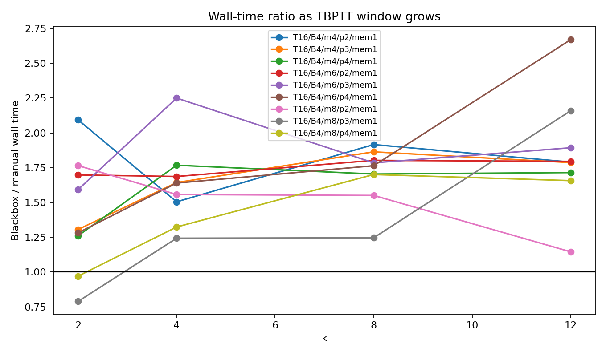

The wall-time ratio generally increases as the retained TBPTT window grows, but
single-repeat wall time is noisy. Some small cases are not monotonic because
process-level timing includes allocator state, Perceval/PyTorch overhead, and
CPU scheduling.

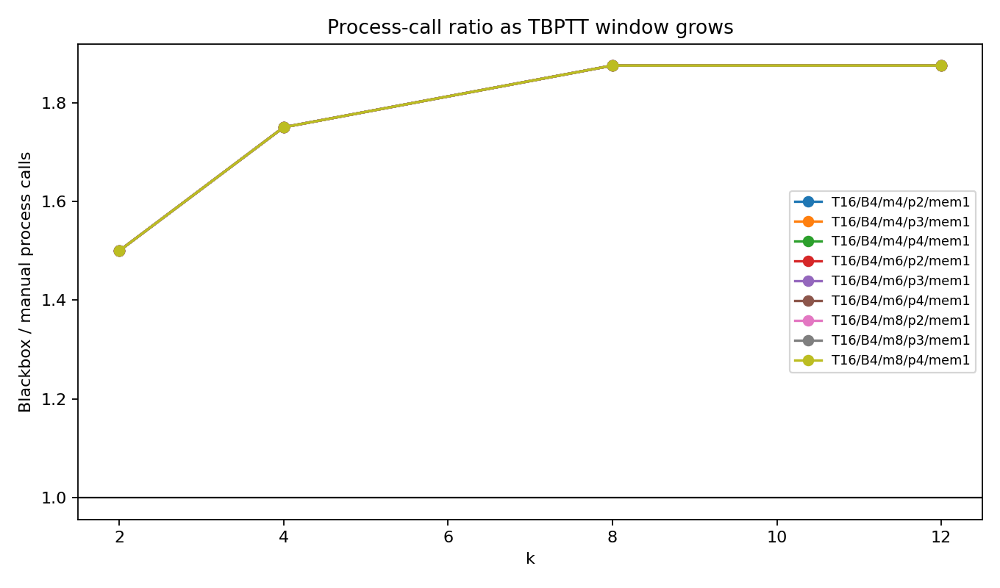

This is the more reliable plot. It shows the expected step-up as `k` grows:
`1.50x`, `1.75x`, then `1.875x`. For fixed `T=16`, the process-call overhead
saturates once `k` is large enough that almost every timestep in a chunk pays
the extra blackbox recomputation cost.

### Scaling Versus Modes And Photons

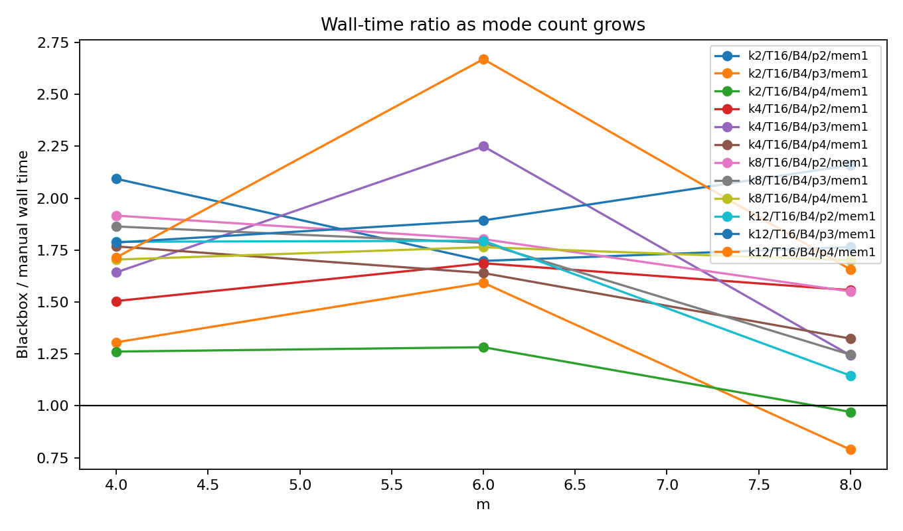

This plot fixes the other workload variables and varies the number of modes.
It is useful but noisier than the call-count plot: larger circuits take longer,
but the blackbox/manual ratio depends on both quantum process cost and Python
overhead.

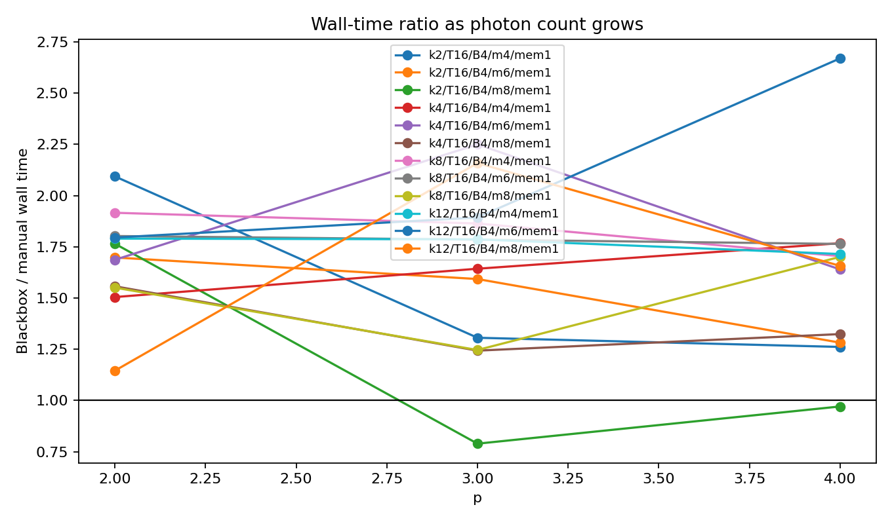

This plot varies photon count with other settings fixed. Again, the timing ratio
is less clean than process calls, but the blackbox path remains structurally
more expensive because it performs more process evaluations.

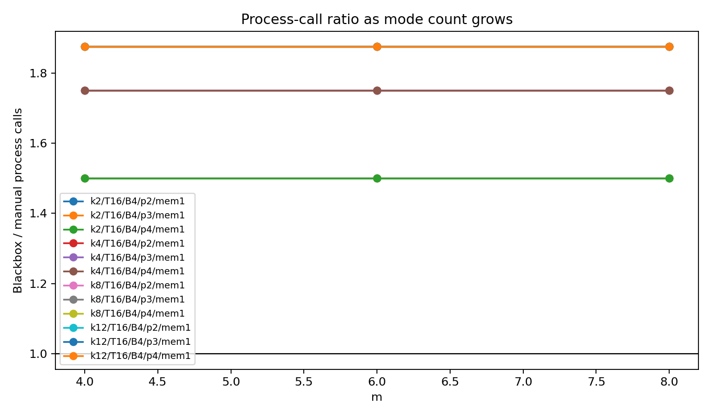


These two process-call plots are flat across modes and photons. That is expected:
for a fixed sequence length and `k`, the number of process calls is determined
by the TBPTT API shape, not by the Hilbert-space size. Modes and photons change
the cost of each call, not the number of calls.

### Focused Repeated k Scaling

To reduce timing noise, I also ran one repeated fixed-condition sweep:

```powershell
.\.venv\Scripts\python.exe benchmarks\run_memristor_tbptt_api_comparison.py `
  --k 2 4 8 12 `
  --timesteps 16 `
  --batch-size 4 `
  --n-modes 8 `
  --n-photons 4 `
  --input-size 2 `
  --memristor-count 1 `
  --entangling-layers 2 `
  --repeats 3 `
  --warmups 0 `
  --json-output .benchmarks\pml327_memristor_tbptt_scaling_k_focused_8m4p.json `
  --csv-output .benchmarks\pml327_memristor_tbptt_scaling_k_focused_8m4p.csv `
  --plot-dir .benchmarks\pml327_memristor_tbptt_scaling_k_focused_8m4p_figures
```

Focused result:

| k | Manual calls | Blackbox calls | Process call ratio | Blackbox/manual wall-time ratio |
|---:|---:|---:|---:|---:|
| 2 | 16 | 24 | 1.50x | 1.34x |
| 4 | 16 | 28 | 1.75x | 1.34x |
| 8 | 16 | 30 | 1.875x | 2.32x |
| 12 | 16 | 30 | 1.875x | 1.58x |

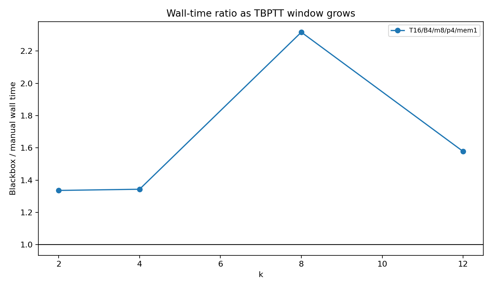

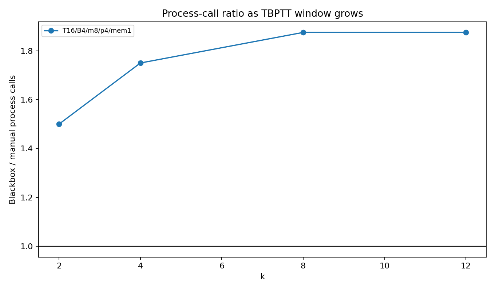

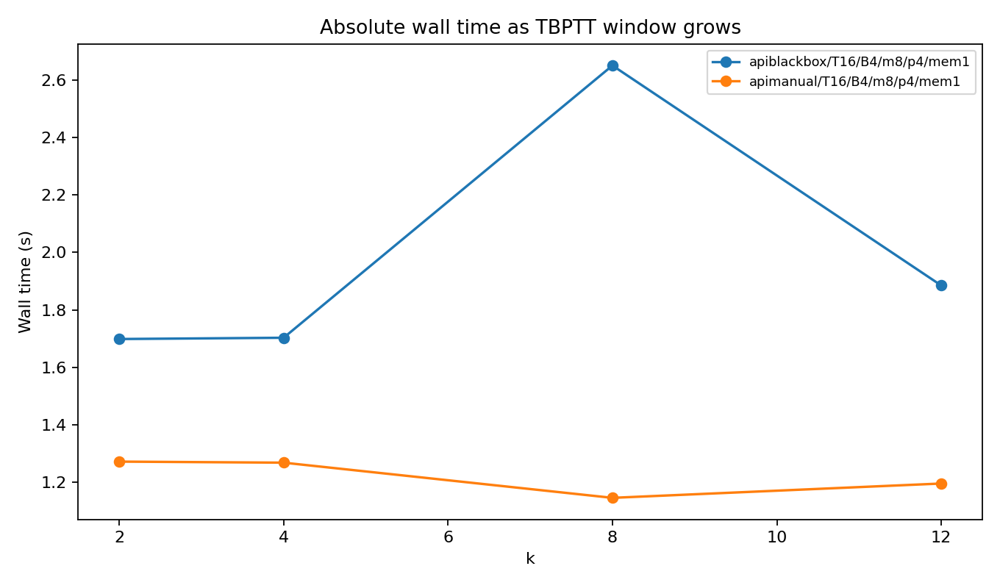

The repeated fixed-condition run is the best evidence for larger `k`. The
manual loop stays at one process call per timestep. The blackbox path rises
toward nearly two calls per timestep and then saturates for this sequence
length. Raw timing follows that trend, with some CPU timing noise.

## Training Workflow Benchmark

The lower-level benchmark above proves that the two APIs can produce matching
outputs and gradients, and that blackbox positive `k` performs extra process
calls. A more user-facing question is whether that matters in an actual training
loop.

To test that, I added:

- `../benchmarks/run_memristor_tbptt_training_workflow.py`

This script trains a small sequence-regression model:

- synthetic sequence batches are generated once;
- fixed targets are generated by a frozen teacher memristive model;
- each student model contains a memristive quantum layer plus a small PyTorch
  readout head;
- Adam updates the trainable quantum parameters and readout parameters;
- loss is computed at every timestep;
- TBPTT boundaries happen every `k` steps;
- blackbox and manual students use the same initialization, data, targets,
  optimizer, and chunking.

Command used:

```powershell
.\.venv\Scripts\python.exe benchmarks\run_memristor_tbptt_training_workflow.py `
  --k 2 4 `
  --timesteps 8 `
  --batch-size 4 `
  --n-batches 4 `
  --epochs 3 `
  --n-modes 6 8 `
  --n-photons 3 4 `
  --input-size 2 `
  --memristor-count 1 2 `
  --entangling-layers 2 `
  --hidden-size 8 `
  --learning-rate 0.01 `
  --repeats 1 `
  --warmups 0 `
  --json-output .benchmarks\pml327_memristor_tbptt_training_workflow.json `
  --csv-output .benchmarks\pml327_memristor_tbptt_training_workflow.csv `
  --plot-dir .benchmarks\pml327_memristor_tbptt_training_workflow_figures
```

Training output files:

- `../.benchmarks/pml327_memristor_tbptt_training_workflow.json`
- `../.benchmarks/pml327_memristor_tbptt_training_workflow.summary.csv`
- `../.benchmarks/pml327_memristor_tbptt_training_workflow.comparisons.csv`
- `../.benchmarks/pml327_memristor_tbptt_training_workflow.runs.csv`

Training figures:

- `../.benchmarks/pml327_memristor_tbptt_training_workflow_figures/training_time_ratio_blackbox_over_manual.png`
- `../.benchmarks/pml327_memristor_tbptt_training_workflow_figures/training_process_call_ratio_blackbox_over_manual.png`
- `../.benchmarks/pml327_memristor_tbptt_training_workflow_figures/training_seconds_by_api.png`
- `../.benchmarks/pml327_memristor_tbptt_training_workflow_figures/training_final_epoch_loss_by_api.png`

### Training Summary

| k | Workloads | Blackbox/manual process call ratio | Blackbox/manual raw training-time ratio | Final loss agreement |
|---:|---:|---:|---:|---:|
| 2 | 8 | 1.50x | 1.22x to 1.39x, average 1.30x | exact in this sweep |
| 4 | 8 | 1.75x | 1.50x to 1.76x, average 1.62x | within about `1.2e-8` |

For `k=2`, each training run performed:

- manual: `96` process calls;
- blackbox: `144` process calls.

For `k=4`, each training run performed:

- manual: `96` process calls;
- blackbox: `168` process calls.

Both APIs learned the same function to the same loss, but the blackbox API took
longer in raw seconds on every workload in this sweep.

### Training Time Ratio

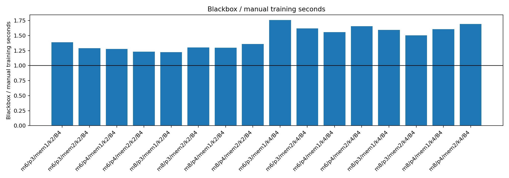

This is the main practical result. Values above `1.0` mean the blackbox API took
longer than the explicit user-managed TBPTT loop.

The result is consistent across all workflow cases:

- `k=2`: blackbox took roughly `1.22x` to `1.39x` the manual training time;
- `k=4`: blackbox took roughly `1.50x` to `1.76x` the manual training time.

The user-visible conclusion is straightforward: when the model is actually
trained with data, losses, and optimizer steps, the blackbox positive-`k`
approach remains slower.

### Training Process Calls

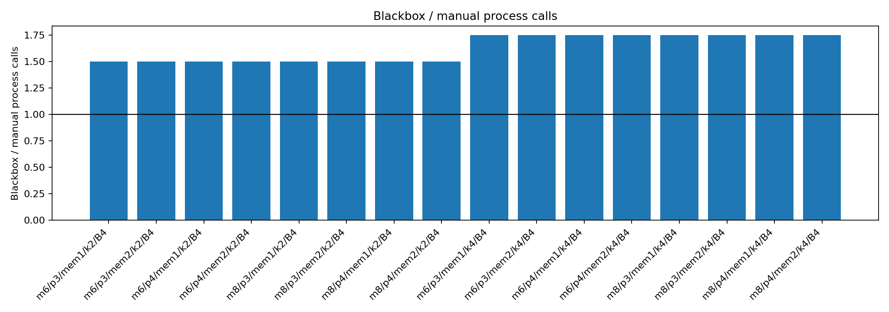

This explains the timing result. The manual loop keeps one quantum process call
per timestep. The blackbox bounded-window implementation performs additional
process calls to reconstruct the differentiable memristive window.

The process-call ratios in the training workflow match the mechanism benchmark:

- `k=2`: `1.50x`;
- `k=4`: `1.75x`.

This means the slowdown is not accidental benchmark noise. It comes from the
shape of the blackbox implementation.

### Raw Training Seconds

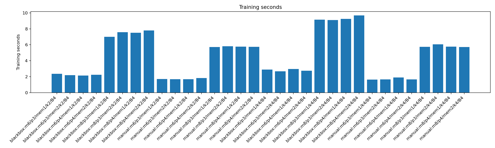

This plot shows the raw seconds per API and workload. The 8-mode cases are
slower than the 6-mode cases, as expected. Within each matching workload, the
blackbox bar is higher than the manual bar.

This is the clearest answer to the practical product question: from a user's
view, the blackbox API takes longer to train in this representative workflow.

### Final Training Loss

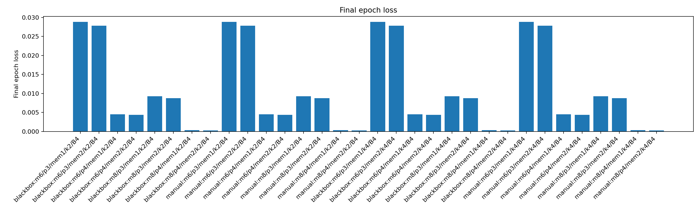

The final losses match between blackbox and manual runs. For `k=2`, the final
epoch losses were exactly equal in this sweep. For `k=4`, the largest difference
was around `1.2e-8`.

This matters because it means the comparison is fair: the manual loop is not
faster because it is training a different objective or dropping useful gradient
inside the configured window. It reaches the same training result with fewer
quantum process calls.

## Time-Series Application Benchmark

The teacher-student workflow above is useful because it is controlled, but it is
still not an application task. I added a third benchmark:

- `../benchmarks/run_memristor_timeseries_workflow.py`

This trains on a generated nonlinear delayed time-series. The model sees the
current value and a seasonal/exogenous feature, then predicts the next value.
The benchmark has train batches, validation batches, optimizer steps, validation
loss, raw seconds, process-call counts, and a prediction plot.

Compared APIs:

- `reservoir`: `num_backprop_steps=0`;
- `manual`: `num_backprop_steps=None` with `detach_memristive_state()` at TBPTT
  chunk boundaries;
- `blackbox`: `num_backprop_steps=k` with the same chunk boundaries.

### Broad Application Sweep

Command:

```powershell
.\.venv\Scripts\python.exe benchmarks\run_memristor_timeseries_workflow.py `
  --k 2 4 `
  --timesteps 12 `
  --batch-size 8 `
  --n-batches 3 `
  --val-batches 1 `
  --epochs 4 `
  --n-modes 6 8 `
  --n-photons 3 4 `
  --input-size 2 `
  --memristor-count 1 `
  --entangling-layers 2 `
  --hidden-size 8 `
  --learning-rate 0.01 `
  --repeats 1 `
  --warmups 0 `
  --json-output .benchmarks\pml327_memristor_timeseries_workflow.json `
  --csv-output .benchmarks\pml327_memristor_timeseries_workflow.csv `
  --plot-dir .benchmarks\pml327_memristor_timeseries_workflow_figures
```

Result files:

- `../.benchmarks/pml327_memristor_timeseries_workflow.json`
- `../.benchmarks/pml327_memristor_timeseries_workflow.summary.csv`
- `../.benchmarks/pml327_memristor_timeseries_workflow.comparisons.csv`
- `../.benchmarks/pml327_memristor_timeseries_workflow.runs.csv`

Broad sweep summary:

| k | Workloads | Blackbox/manual process call ratio | Blackbox/manual raw time ratio | Validation loss delta |
|---:|---:|---:|---:|---:|
| 2 | 4 | 1.375x | 0.81x to 1.49x, average 1.13x | 0 in this sweep |
| 4 | 4 | 1.5625x | 1.02x to 1.53x, average 1.37x | at numerical noise |

This run is application-shaped, but the raw timing is noisier than the
mechanism-level benchmark. One `k=2`, 6-mode/3-photon case had blackbox faster
despite more process calls. The heavier cases and the average still favor the
manual loop, especially for `k=4`.

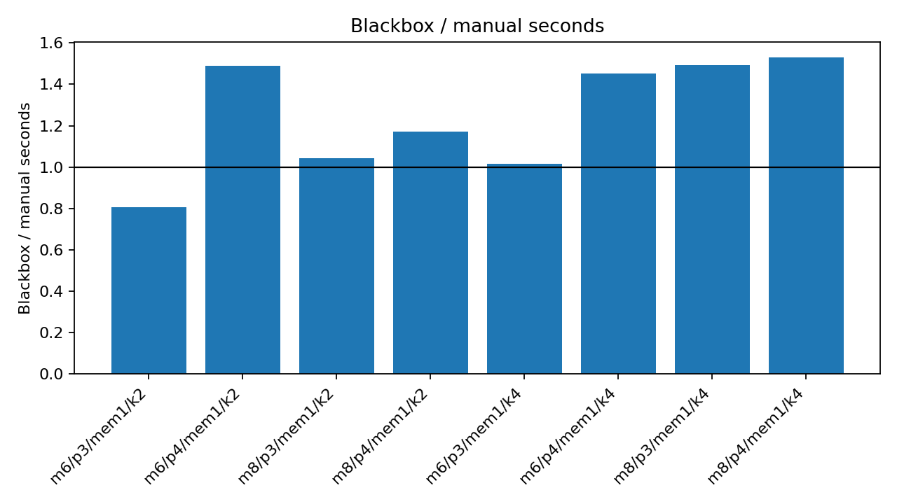

The time ratio plot shows that application-level wall time does not perfectly
track process-call ratio in every small case. Still, blackbox becomes clearly
slower as the workload gets heavier and as `k` grows.

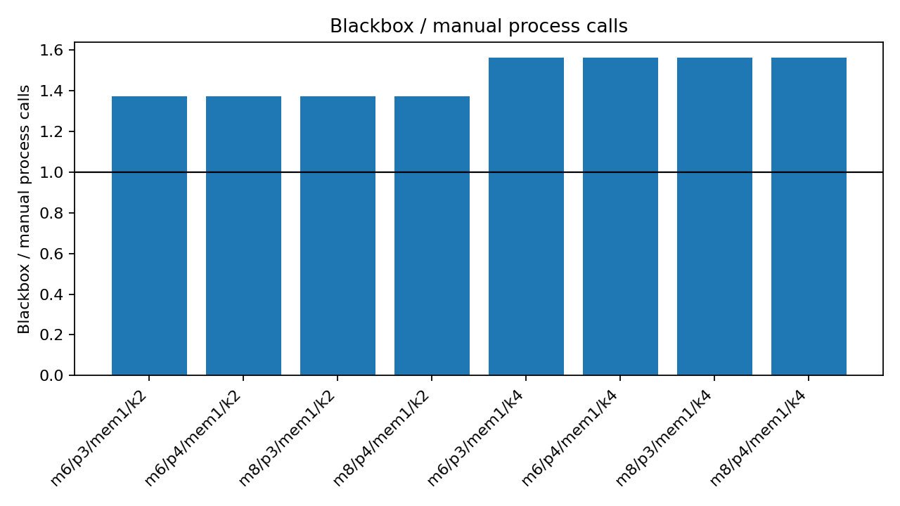

The process-call ratio is stable. Even in the application workflow, blackbox
does extra quantum process work: `1.375x` for `k=2`, `1.5625x` for `k=4` in this
particular `T=12` setup.

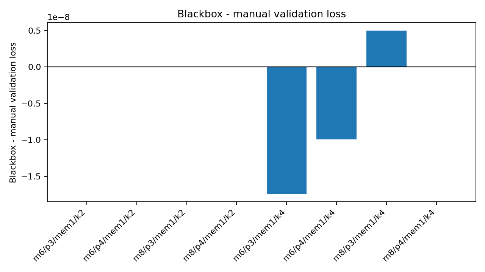

Validation losses are effectively identical. The application benchmark is
therefore not showing a quality advantage for blackbox; it is measuring runtime
for the same learning outcome.

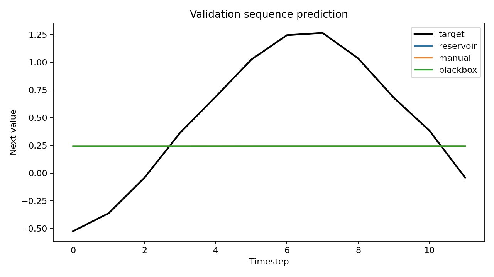

The prediction plot confirms that the benchmark is running an actual forecasting
loop against validation targets, not only synthetic graph construction. For this
small task, the three API variants make nearly identical predictions.

### Focused Balanced Application Run

Because the broad sweep used a single repeat, I added a focused heavier run with
rotated API order across repeats to reduce fixed-order timing bias:

```powershell
.\.venv\Scripts\python.exe benchmarks\run_memristor_timeseries_workflow.py `
  --apis manual blackbox `
  --k 2 4 `
  --timesteps 12 `
  --batch-size 8 `
  --n-batches 3 `
  --val-batches 1 `
  --epochs 4 `
  --n-modes 8 `
  --n-photons 4 `
  --input-size 2 `
  --memristor-count 1 `
  --entangling-layers 2 `
  --hidden-size 8 `
  --learning-rate 0.01 `
  --repeats 3 `
  --warmups 0 `
  --json-output .benchmarks\pml327_memristor_timeseries_focused_8m4p_balanced.json `
  --csv-output .benchmarks\pml327_memristor_timeseries_focused_8m4p_balanced.csv `
  --plot-dir .benchmarks\pml327_memristor_timeseries_focused_8m4p_balanced_figures
```

Focused result:

| k | Manual seconds | Blackbox seconds | Blackbox/manual time ratio | Process call ratio | Validation loss delta |
|---:|---:|---:|---:|---:|---:|
| 2 | 15.41s | 21.21s | 1.38x | 1.375x | 0 |
| 4 | 14.08s | 20.16s | 1.43x | 1.5625x | about `2.1e-9` |

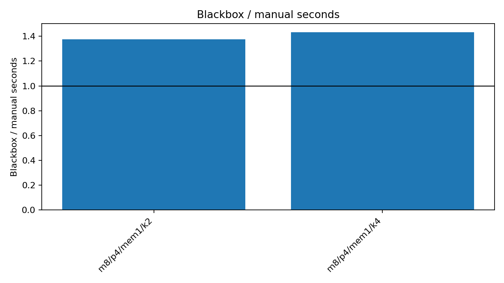

This focused result is the most useful application-level timing evidence. With
the same validation loss, blackbox is slower in raw seconds on the heavier
8-mode/4-photon case.

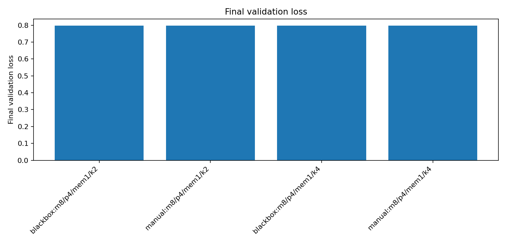

The validation loss is the same for manual and blackbox. The speed difference is
therefore not explained by one approach failing to train or solving a different
task.

### Application Interpretation

This application benchmark does not prove that memristive recurrence improves
forecasting quality on this small synthetic series. In fact, reservoir, manual,
and blackbox variants often end at the same validation loss because they share
the same numerical memristor state evolution and differ mainly in whether
future losses can train through that recurrent state.

For the API decision, that is still useful: on an actual train/validation
forecasting loop, blackbox positive `k` provides no quality advantage in this
task and remains more expensive in process calls. In the focused balanced run,
that extra process work also shows up directly as longer raw training time.

## Tests Run

Focused checks:

```powershell
.\.venv\Scripts\python.exe -m ruff check `
  merlin\algorithms\layer.py `
  merlin\builder\circuit_builder.py `
  tests\algorithms\test_layer.py `
  benchmarks\run_memristor_tbptt_api_comparison.py `
  benchmarks\run_memristor_tbptt_training_workflow.py `
  benchmarks\run_memristor_timeseries_workflow.py
```

Result:

```text
All checks passed!
```

Layer test file:

```powershell
.\.venv\Scripts\python.exe -m pytest tests\algorithms\test_layer.py -q --tb=short -p no:cacheprovider
```

Result:

```text
71 passed, 1 skipped
```

The added tests include a two-memristor circuit and verify that the manual
`detach_memristive_state()` loop preserves memristor values while detaching the
graph, and that blackbox `k=2` matches the manual loop numerically on the same
two-memristor workload.

## Interpretation

The blackbox positive-`k` API works numerically for the benchmarked cases, but
it achieves that by doing extra quantum process calls. The manual loop gives the
user standard PyTorch TBPTT control and keeps the computation shape simpler:
one forward call corresponds to one quantum process call in the benchmark.

For this reason, these results support keeping the default conservative
behavior and exposing enough API for users to do TBPTT explicitly:

- `num_backprop_steps=0` for reservoir-like behavior with no recurrent gradient;
- full history when explicitly requested;
- `detach_memristive_state()` for user-managed TBPTT chunking.

Positive blackbox `k` is convenient, but based on this benchmark it is not the
more economical implementation. If it remains part of the API, the extra process
calls should be documented clearly because they are the main performance cost.
