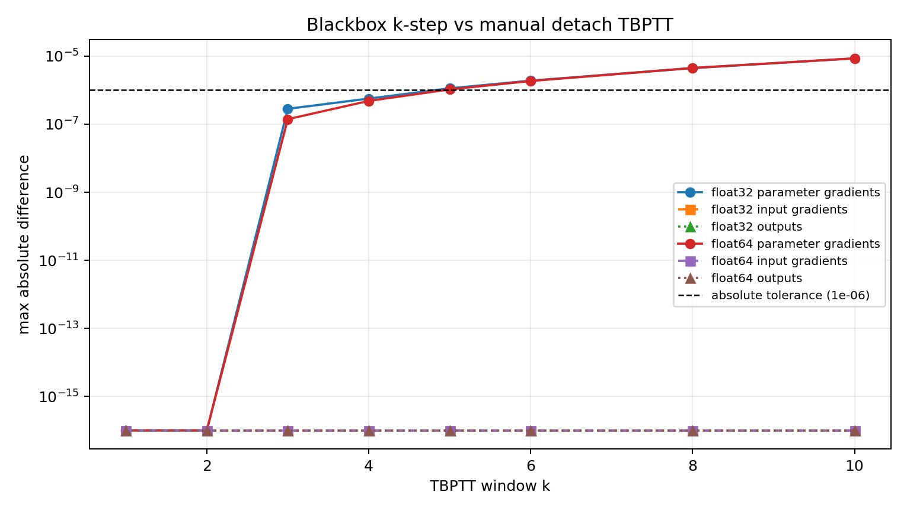
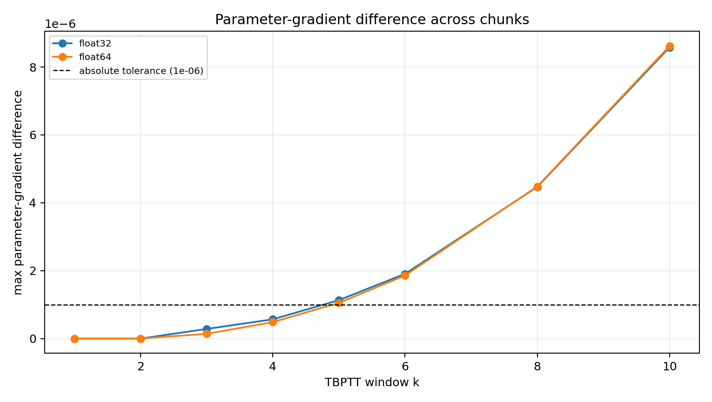

# PML-327 Memristor TBPTT Gradient Comparison

This note records a diagnostic comparison between the two benchmark APIs for
truncated backpropagation through memristive `QuantumLayer` state:

- blackbox finite window: `num_backprop_steps=k`;
- manual TBPTT: `num_backprop_steps=None`, with
  `detach_memristive_state()` called at chunk boundaries.

The implementation under test was not changed for this diagnostic. The script
compares outputs, losses, input gradients, parameter gradients at every chunk
boundary, and final memristive state.

## Command

```powershell
.\.venv\Scripts\python.exe benchmarks\run_memristor_tbptt_gradient_comparison.py `
  --k 1 2 3 4 5 6 8 10 `
  --dtype float32 float64 `
  --json-output .benchmarks\pml327_memristor_tbptt_gradient_comparison\gradient_comparison_extended.json `
  --plot-dir docs\pml327_memristor_tbptt_gradient_comparison
```

Run context:

- Python: `3.12.10`
- Torch: `2.10.0+cpu`
- Device: `cpu`
- Platform: `Windows-11-10.0.26200-SP0`
- Tolerance used by the diagnostic: `atol=1e-6`, `rtol=1e-5`

## Result

Forward outputs, losses, input gradients, and final memristive state matched
exactly for every tested `k` and dtype. Parameter gradients were exactly equal
for `k=1` and `k=2`, then developed small differences as the retained window
grew.

The largest observed parameter-gradient difference was about `8.6e-6` at
`k=10`. The float32 `k=10` case exceeded the diagnostic's default tolerance in
one chunk, so it is marked `diff`; the absolute difference remains small.





| dtype | k | T | max output diff | max input-grad diff | max param-grad diff | status |
|---|---:|---:|---:|---:|---:|---|
| float32 | 1 | 3 | 0.000e+00 | 0.000e+00 | 0.000e+00 | pass |
| float32 | 2 | 5 | 0.000e+00 | 0.000e+00 | 0.000e+00 | pass |
| float32 | 3 | 7 | 0.000e+00 | 0.000e+00 | 2.831e-07 | pass |
| float32 | 4 | 9 | 0.000e+00 | 0.000e+00 | 5.662e-07 | pass |
| float32 | 5 | 11 | 0.000e+00 | 0.000e+00 | 1.132e-06 | pass |
| float32 | 6 | 13 | 0.000e+00 | 0.000e+00 | 1.907e-06 | pass |
| float32 | 8 | 17 | 0.000e+00 | 0.000e+00 | 4.470e-06 | pass |
| float32 | 10 | 21 | 0.000e+00 | 0.000e+00 | 8.583e-06 | diff |
| float64 | 1 | 3 | 0.000e+00 | 0.000e+00 | 0.000e+00 | pass |
| float64 | 2 | 5 | 0.000e+00 | 0.000e+00 | 0.000e+00 | pass |
| float64 | 3 | 7 | 0.000e+00 | 0.000e+00 | 1.404e-07 | pass |
| float64 | 4 | 9 | 0.000e+00 | 0.000e+00 | 4.831e-07 | pass |
| float64 | 5 | 11 | 0.000e+00 | 0.000e+00 | 1.053e-06 | pass |
| float64 | 6 | 13 | 0.000e+00 | 0.000e+00 | 1.859e-06 | pass |
| float64 | 8 | 17 | 0.000e+00 | 0.000e+00 | 4.484e-06 | pass |
| float64 | 10 | 21 | 0.000e+00 | 0.000e+00 | 8.622e-06 | pass |

## Equivalence Conclusion

The two implementations are not strictly the same.

They agree exactly on the quantities that define the forward recurrent
trajectory in this benchmark:

- forward outputs;
- losses;
- input gradients;
- final memristive state.

They do not agree exactly on trainable circuit parameter gradients for larger
windows. Parameter gradients are identical for `k=1` and `k=2`, then small
non-zero differences appear from `k=3` onward and increase with the window
length in this run.

Therefore, for the tested workload, `num_backprop_steps=k` and the manual
`detach_memristive_state()` loop are equivalent for forward values and
input-side TBPTT behavior, but they are not a strictly identical implementation
of parameter-gradient backpropagation.

## Why They Differ

The manual TBPTT loop lets PyTorch keep the exact graph created by each forward
call in a chunk:

```text
input[t] -> output[t] -> memristive_state[t + 1]
```

At the chunk boundary, `loss.backward()` traverses that same graph. After
backward, `detach_memristive_state()` cuts the recurrent state before the next
chunk.

The blackbox `num_backprop_steps=k` path has a different graph structure. It
keeps the runtime memristive state detached so the graph does not grow without
bound, then reconstructs the recent `k`-step state window internally from stored
outputs. This reconstruction preserves the forward values, but it is not the
same autograd graph as the manual chunk.

That distinction mostly affects trainable circuit parameters. A parameter can
influence a later loss directly through the current output and indirectly
through earlier outputs that updated later memristive states. The manual loop
keeps those indirect paths in the original forward graph. The blackbox path
replays the recent state window from stored outputs, so the indirect
parameter-gradient path is close but not identical.

Longer windows replay more state-update steps, which gives these small
parameter-gradient differences more opportunities to accumulate. That is why
the difference is zero for `k=1` and `k=2` in this run, then grows gradually for
larger `k`.

Raw data:

- `.benchmarks/pml327_memristor_tbptt_gradient_comparison/gradient_comparison_extended.json`
