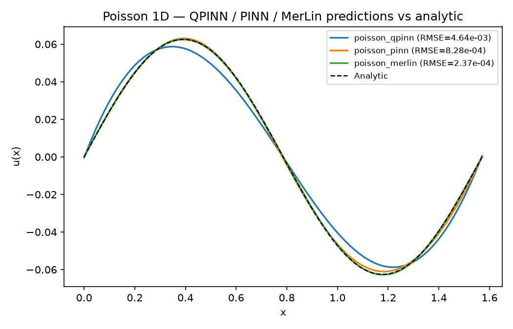

:github_url: https://github.com/merlinquantum/merlin

==================================================================
CV-QPINN: Quantum Physics-Informed Neural Networks for PDEs
==================================================================

.. admonition:: Paper Information
   :class: note

   **Title**: Quantum physics informed neural networks for multi-variable partial differential equations

   **Authors**: Giorgio Panichi, Sebastiano Corli, Enrico Prati

   **Published**: arXiv preprint (v2, November 2025)

   **DOI**: `10.48550/arXiv.2503.12244 <https://doi.org/10.48550/arXiv.2503.12244>`_

   .. merlin-citations-badge:: cv_qpinn

   **Paper URL**: `arXiv:2503.12244 <https://arxiv.org/abs/2503.12244>`_

   **Reproduction Status**: ⚠️ Partial — the reproduction is faithful, but the paper's quantum-advantage reading does not survive a matched-effort baseline

   **Reproducer**: Benjamin Stott

Project Repository
==================

.. merlin-gallery::
   :data: _data/galleries/reproduced_papers/cv_qpinn_external_links.json
   :columns: 2
   :contour-color: #5648ED

Abstract
========

The paper combines the continuous-variable (CV) quantum neural network ansatz of
Killoran et al. with the Physics-Informed Neural Network loss design of Raissi et
al. Its central contribution is a **multi-output architecture with a consistency
loss**: instead of obtaining a high-order derivative by differentiating the
network through itself, the network exposes one homodyne read-out per derivative
order and a loss term pins each output to the auto-differentiated derivative of
the preceding one. This removes the nested automatic differentiation that
otherwise dominates memory in CV simulators. The method is demonstrated on the 1D
Poisson equation and the 1D heat equation, together with a photon-loss noise
model distilled from Xanadu's X8 processor.

Significance
============

Nested autograd through a Fock-truncated CV simulator is the practical ceiling on
how high an order of PDE such a network can address. The consistency loss is a
genuine structural answer to that problem, and it is the part of the paper that
generalises beyond photonics. This reproduction sets out to check two separate
things: whether the architecture reproduces the paper's reported errors, and
whether the consistency loss is preferable to nested autograd once both are run
at a matched epoch budget rather than compared only on memory.

MerLin Implementation
=====================

The reproduction is self-contained and does not use Strawberry Fields:

* ``lib/cv_simulator.py`` — a Fock-truncated CV simulator written directly in
  PyTorch, covering rotation, beam-splitter, squeezing, displacement and Kerr
  gates on one- and two-qumode systems, plus the photon-loss channel.
* ``lib/qpinn_model.py`` — the Killoran-style multi-qumode and single-qumode
  layers and the QPINN read-out.
* ``lib/losses.py`` — the consistency-loss PINN objectives for both PDEs, and
  ``poisson_nested_loss`` for the head-to-head ablation.
* ``lib/pinn_baseline.py`` — a classical fully-connected ``tanh`` PINN whose
  width is chosen to match the QPINN's trainable-parameter count, returning the
  same ``(u, u_x)`` pair and trained with the very same loss.
* ``lib/merlin_pinn.py`` — a MerLin adaptation that re-uses the consistency-loss
  training scheme on a linear-optical interferometer.

Experimental Results
====================

**1D Poisson equation** (paper Table II / §IV.A). All reproduction rows are
single-seed.

.. list-table:: Poisson: RMSE against the analytic solution ``u(x) = sin(4x)/16``
   :header-rows: 1
   :widths: 40 12 16 16 16

   * - Setting
     - Params
     - RMSE
     - NMSE
     - Wall time
   * - Paper QPINN (8 layers, cutoff 10, 5000 ep)
     - 88
     - 1.09e-4
     - 6.08e-6
     - not stated
   * - Reproduction QPINN (2+2 layers, cutoff 8, 200 ep)
     - 48
     - 4.64e-3
     - 1.11e-2
     - 168 s
   * - Reproduction classical PINN (3000 ep, lr 5e-3)
     - 90
     - 8.28e-4
     - 3.53e-4
     - 102 s
   * - Reproduction MerLin PINN (6 modes, 3 photons, 600 ep)
     - 162
     - 2.37e-4
     - 2.90e-5
     - 25 s

   Poisson predictions against the analytic solution. The MerLin linear-optics
   adaptation reaches the same order of magnitude as the paper's reported QPINN
   RMSE in 600 epochs; the CV-QPINN smoke configuration is visibly the loosest
   fit, running 25x fewer epochs at a lower Fock cutoff than the paper.

**1D heat equation** (paper Table IV / §IV.B). The reproduction rows are means
over 5 seeds (42, 7, 123, 256, 1024).

.. list-table:: Heat equation: error against an RK45 reference
   :header-rows: 1
   :widths: 38 10 16 12 12 12

   * - Setting
     - Params
     - RMSE (mean)
     - RMSE std
     - MAE
     - L∞
   * - Paper QPINN (4 layers, cutoff 20, 1000 ep)
     - 44
     - 1.24e-2
     - —
     - 9.63e-3
     - 3.93e-2
   * - Paper classical PINN
     - 44
     - 2.09e-2
     - —
     - 1.48e-2
     - 9.04e-2
   * - Reproduction QPINN (2+2, cutoff 10, 60+200 ep)
     - 48
     - 1.23e-2
     - 4.8e-3
     - 8.6e-3
     - 5.6e-2
   * - Reproduction classical PINN (300+1000 ep)
     - 42
     - 8.74e-3
     - 1.2e-3
     - 7.0e-3
     - 3.0e-2

.. figure:: ../../_static/reproduced_papers/CV_QPINN_PDE/heat_qpinn.png
   :alt: Heat-equation QPINN prediction, RK45 reference and absolute error over the space-time domain
   :align: center
   :width: 100%

   A single smoke run of the heat QPINN (60 + 250 epochs, RMSE 8.95e-3 for this
   seed) against the RK45 reference. The error concentrates at early times near
   the peak of the Gaussian initial condition, where the solution changes
   fastest and the collocation points are sparsest relative to the gradient.

Three readings follow from that table.

1. The reproduced QPINN lands on top of the paper's reported QPINN RMSE
   (1.23e-2 against 1.24e-2), so the architecture and its training reproduce
   faithfully.
2. The reproduced classical baseline beats the paper's reported classical PINN
   by 2.4x. The likely cause is that the paper's classical comparator uses
   nested autograd, whereas this reproduction applies the consistency-loss
   scheme to *both* sides for a like-for-like comparison.
3. Under matched-effort training the classical PINN beats the QPINN by 1.40x on
   the mean and is about 4x more stable across seeds. The QPINN mean sits 2.9
   classical-PINN standard deviations above the classical mean, so the gap is
   not seed noise. **The paper's slight-quantum-advantage reading of Table IV
   does not survive a fair re-baseline.**

**Nested autograd versus the consistency loss.** Both losses were run head to
head on the same architecture at 200 epochs.

.. list-table:: Poisson: nested autograd against the paper's consistency loss
   :header-rows: 1
   :widths: 14 24 20 16 26

   * - Cutoff
     - Loss
     - RMSE
     - Wall
     - Notes
   * - 8
     - nested
     - 4.24e-5
     - 85 s
     - direct ``u_xx`` via autograd-of-autograd
   * - 8
     - consistency
     - 4.64e-3
     - 168 s
     - the paper's scheme
   * - 12
     - nested
     - 1.51e-4
     - 141 s
     -
   * - 12
     - consistency
     - 1.85e-3
     - 115 s
     -

The consistency loss is a real memory optimisation — measured peak-RSS delta for
the nested path rises from 2 MB at cutoff 10 to 30 MB at cutoff 12 — but it costs
12-100x in accuracy at the same epoch budget in this regime, a trade-off the
paper does not flag. At the paper's own cutoff (15-20) the nested memory wall
presumably reverses the ordering, but the regime in which the consistency loss is
strictly better is narrower than the paper implies.

Implementation Details
======================

Run from the reproduced-papers repository root:

.. code-block:: bash

   # Smoke run (CPU-friendly): Poisson QPINN, 2+2 layers, cutoff 8
   python implementation.py --paper CV_QPINN_PDE --config configs/poisson_smoke.json

   # Paper-accurate Poisson QPINN (Table V hyperparameters)
   python implementation.py --paper CV_QPINN_PDE --config configs/poisson_original.json

   # Classical PINN baseline, matched on parameter count
   python implementation.py --paper CV_QPINN_PDE --config configs/poisson_pinn.json

   # MerLin photonic adaptation
   python implementation.py --paper CV_QPINN_PDE --config configs/poisson_merlin.json

The heat-equation counterparts are ``heat_smoke.json``, ``heat_original.json``
and ``heat_pinn.json``. The ``*_original.json`` configurations use the paper's
Table V/VI hyperparameters and take hours on CPU; the smoke configurations are
sized for single-digit minutes. ``notebook.ipynb`` in the paper folder builds the
simulator, the QPINN and the consistency loss step by step and re-plots every
headline run.

MerLin Photonic Extension
=========================

The paper's photonic target is *continuous-variable* photonic computing, whereas
MerLin targets *linear-optical* photonic computing, where squeezing, displacement
and Kerr gates are not native primitives. This reproduction therefore does not
claim a literal MerLin port of the paper's circuit. Instead ``lib/merlin_pinn.py``
re-uses the consistency-loss training idea on a MerLin interferometer with angle
encoding, mapping ``UNBUNCHED`` detection probabilities to ``(u, u_x)`` through
two trainable linear heads.

.. list-table:: Hardware-aware settings (MerLin variant)
   :header-rows: 1
   :widths: 40 60

   * - Field
     - Value
   * - Computation space
     - ``UNBUNCHED``
   * - Detector model
     - threshold
   * - Photon number
     - 3
   * - Number of modes
     - 6
   * - Input state
     - ``[1, 0, 1, 0, 1, 0]``
   * - Encoding
     - angle, modes ``[0, 1, 2]``, scale ``π/2``
   * - Measurement strategy
     - ``MeasurementStrategy.probs(computation_space=UNBUNCHED)``
   * - Postselection
     - none
   * - Simulator
     - MerLin CPU simulator (analytic, shots = 0)
   * - Seeds
     - 42 (single seed)

The MerLin model was originally trained under ``merlinquantum`` 0.3.2 and has
been ported to the 0.4 API. Re-running ``poisson_merlin.json`` under 0.4.0
reproduces the committed metric to five significant figures (RMSE 2.3728e-4
against 2.3727e-4).

Deviations and Limitations
==========================

* **No Strawberry Fields, no TensorFlow.** The paper uses Strawberry Fields with
  the TF backend, which pins TensorFlow versions unavailable on the target Python
  3.12 environment. The CV simulator is re-implemented in PyTorch with
  ``matrix_exp`` inside a Fock truncation. Every gate's mathematical content is
  preserved, but the gradient path is autograd through ``matrix_exp`` rather than
  TensorFlow's; if the paper's results depend on that exact path, behaviour could
  differ.
* **The MerLin variant is a different photonic architecture** and must not be
  read as a one-to-one CV photonic translation.
* **The X8 noise study from §V is implemented at the gate level but not run** as
  part of the headline reproduction, to keep wall-clock manageable.
* The simulator defaults to ``complex128`` to avoid losing trace under deep CV
  circuits.
* Poisson results are single-seed; only the heat-equation comparison is run over
  five seeds.

Code Access and Documentation
=============================

**GitHub Repository**: `merlinquantum/reproduced_papers (CV_QPINN_PDE) <https://github.com/merlinquantum/reproduced_papers/tree/main/papers/CV_QPINN_PDE>`_

Citation
========

.. code-block:: bibtex

   @misc{panichi_quantum_2025,
     title={Quantum physics informed neural networks for multi-variable partial differential equations},
     author={Panichi, Giorgio and Corli, Sebastiano and Prati, Enrico},
     year={2025},
     eprint={2503.12244},
     archivePrefix={arXiv},
     primaryClass={quant-ph},
     doi={10.48550/arXiv.2503.12244}
   }

Related Reproductions
=====================

* :doc:`hqpinn` — a hybrid quantum PINN on the same problem family, useful as a
  contrast in how the quantum layer is inserted into the PINN loss.
