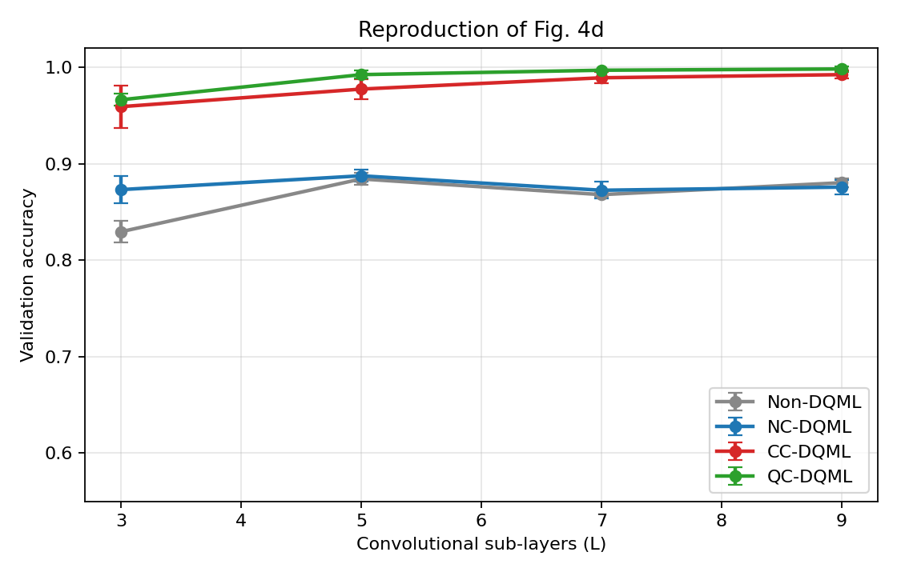
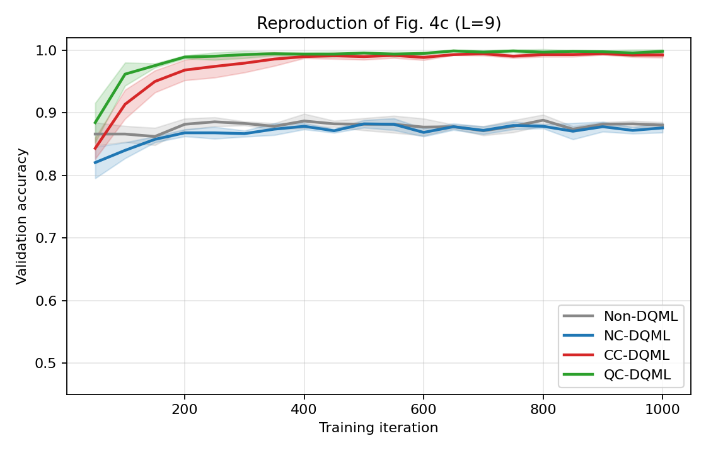
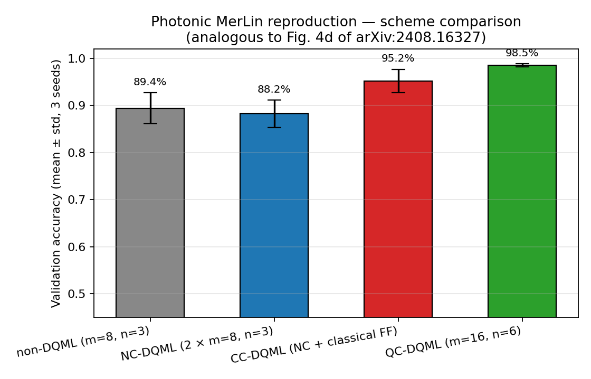

:github_url: https://github.com/merlinquantum/merlin

================================================================
Distributed Quantum Machine Learning via Classical Communication
================================================================

.. admonition:: Paper Information
   :class: note

   **Title**: Distributed quantum machine learning via classical communication

   **Authors**: Kiwmann Hwang, Hyang-Tag Lim, Yong-Su Kim, Daniel K. Park, Yosep Kim

   **Published**: Quantum Science and Technology 10, 015059 (2025)

   **DOI**: `10.1088/2058-9565/ad9cb9 <https://doi.org/10.1088/2058-9565/ad9cb9>`_

   .. merlin-citations-badge:: distributed_qml_cc

   **Paper URL**: `arXiv:2408.16327 <https://arxiv.org/abs/2408.16327>`_

   **Reproduction Status**: ✅ Complete

   **Reproducer**: Jean Senellart (jean.senellart@quandela.com)

Project Repository
==================

.. merlin-gallery::
   :data: _data/galleries/reproduced_papers/distributed_qml_cc_external_links.json
   :columns: 2
   :contour-color: #5648ED

Abstract
========

Running a quantum model across two processors normally requires quantum
communication between them. The paper asks how much of that capability survives
if the link is classical instead: a mid-circuit measurement on one processor,
followed by a feedforward operation conditioned on the outcome on the other.
Four schemes are compared on an eight-dimensional synthetic classification task,
each built from small QCNNs with a trainable interpret function over the joint
readouts.

.. list-table:: The four schemes
   :header-rows: 1
   :widths: 20 80

   * - Scheme
     - Description
   * - non-DQML
     - One 4-qubit processor, embedding repeated to cover all eight attributes
   * - NC-DQML
     - Two 4-qubit processors, no operations between them
   * - CC-DQML
     - Two processors linked by cross-processor classical feedforward
   * - QC-DQML
     - Two processors linked by cross-processor two-qubit gates

The paper's claim is that CC-DQML closely matches QC-DQML at the tested depths
and substantially outperforms NC-DQML, making classical communication a
near-term substitute for quantum communication on this benchmark.

Significance
============

Mid-circuit measurement and feedforward are available on current hardware,
whereas coherent links between processors are not. If a classical link recovers
most of the benefit of a quantum one, distributed quantum models become
buildable now. The question also transfers directly to photonics, where the
distinction is between separate chips coordinated classically and one larger
coherent chip.

MerLin Implementation
=====================

The gate-model side uses a direct PyTorch state-vector simulator
(``lib/simulator.py``) rather than PennyLane, which is autograd-compatible and
faster on circuits this small. The pooling block is reformulated by deferred
measurement, which gives mathematically identical output distributions.

The photonic translation maps each scheme onto MerLin chips. ``lib/merlin_model.py``
covers the single-chip baseline and ``lib/merlin_distributed.py`` the three
distributed schemes. All chips use angle encoding at unit scale with evenly
spread input photon states, and a trainable ``Softmax(Linear(C(m, n), 2))``
soft-bit head standing in for the gate model's trainable pooling tree.

.. list-table:: Scheme to photonic geometry
   :header-rows: 1
   :widths: 16 44 40

   * - Scheme
     - Photonic geometry
     - Inter-chip channel
   * - non-DQML
     - one chip, 8 modes, 3 photons, all attributes encoded
     - not applicable
   * - NC-DQML
     - two chips, 8 modes and 3 photons each, 4 attributes per chip
     - none
   * - CC-DQML
     - two chips as above
     - classical: chip 0's soft bit weights two trainable feedforward phases encoded on an extra mode of chip 1
   * - QC-DQML
     - one chip, 16 modes, 6 photons
     - implicit, one coherent chip

Key Contributions Reproduced
============================

**The four schemes and the accuracy sweep**
  * Implemented the synthetic generator, the QCNN blocks, all four schemes and
    the interpret-function readout.
  * Swept validation accuracy over depths L in {3, 5, 7, 9} at three seeds.
  * Reproduced the paper's ordering: CC matches QC within 1 to 1.5 percentage
    points, and both exceed NC by 9 to 12 points.

**A photonic translation of the communication question**
  * Mapped classical feedforward onto a soft-bit-weighted conditional phase
    shifter, and quantum communication onto a single larger chip.
  * Recovered the same central ordering on the photonic side.

**Fair classical baseline**
  * Added an iso-parameter classical MLP, which turns out to matter for how the
    results should be read.

Implementation Details
======================

.. code-block:: bash

   # Smoke run
   python implementation.py --paper distributed_qml_cc

   # CC-DQML at the paper's L = 9
   python implementation.py --paper distributed_qml_cc \
       --config papers/distributed_qml_cc/configs/classification_original.json \
       --scheme cc --n-layers 9

   # Full sweep over scheme, depth and seed
   cd papers/distributed_qml_cc
   python utils/run_sweep.py --schemes non,nc,cc,qc --layers 3,5,7,9 \
       --seeds 0,1,2 --iterations 1000 --outdir results/sweep

The dataset is synthetic and regenerated on every run following the paper's
Appendix B: 2048 vectors from the 8D ball of radius pi/4, formed into 32
clusters translated to distinct hypercube corners, split 1536 train and 512
validation.

Experimental Results
====================

Gate-model sweep
----------------

Validation accuracy at 1000 iterations, mean ± std over 3 seeds. Paper values
from Table I are given in parentheses.

.. list-table:: Table I reproduction
   :header-rows: 1
   :widths: 8 23 23 23 23

   * - L
     - non-DQML
     - NC-DQML
     - CC-DQML
     - QC-DQML
   * - 3
     - 82.94 ± 1.13 (70.6)
     - 87.30 ± 1.39 (84.6)
     - 95.90 ± 2.22 (90.0)
     - 96.61 ± 0.64 (89.5)
   * - 5
     - 88.41 ± 0.64 (75.5)
     - 88.74 ± 0.60 (86.3)
     - 97.72 ± 1.06 (93.1)
     - 99.22 ± 0.42 (93.2)
   * - 7
     - 86.78 ± 0.18 (75.1)
     - 87.24 ± 0.88 (86.7)
     - 98.89 ± 0.56 (96.0)
     - 99.67 ± 0.09 (95.4)
   * - 9
     - 88.02 ± 0.46 (78.1)
     - 87.57 ± 0.74 (88.1)
     - 99.22 ± 0.42 (96.8)
     - 99.80 ± 0.28 (96.0)

   Reproduction of Figure 4d. CC and QC track each other across depth while NC
   and non-DQML sit well below.

Absolute accuracies run a few points above the paper's, but all four
qualitative claims hold: CC matches QC at every depth tested, CC exceeds NC by a
wide margin, NC edges out non-DQML at most depths, and QC converges faster than
CC even where their final accuracies agree.

   Reproduction of Figure 4c at L = 9, mean ± std over 3 seeds.

Photonic translation
--------------------

Three seeds, 800 iterations, Adam at 0.05, batch size 256.

.. list-table:: Photonic schemes
   :header-rows: 1
   :widths: 28 18 27 27

   * - Scheme
     - Params
     - Final val accuracy
     - Best val accuracy
   * - non-DQML
     - 120
     - 89.39 ± 3.29
     - 90.17 ± 2.65
   * - NC-DQML
     - 472
     - 88.22 ± 2.91
     - 88.80 ± 3.15
   * - CC-DQML
     - 563
     - 95.18 ± 2.47
     - 96.29 ± 2.63
   * - QC-DQML
     - 16514
     - 98.50 ± 0.33
     - 99.02 ± 0.16

   Photonic analogue of Figure 4d.

The photonic side recovers the central ordering. CC pulls seven percentage
points clear of NC by adding roughly 90 trainable parameters, two feedforward
phases and a soft-bit head, and QC closes the remaining three-point gap at
thirty times the parameter count. One difference from the gate model: NC sits
just below non-DQML here rather than above it, a consequence of the chip-size
choice.

Fair baseline
-------------

.. list-table::
   :header-rows: 1
   :widths: 30 15 30 25

   * - Model
     - Params
     - Validation accuracy
     - Note
   * - TinyMLP, hidden 8
     - 137
     - 98.50 ± 0.74
     - iso-parameter classical reference

This is the result that shapes how the rest should be read. A 137-parameter
classical network solves the benchmark essentially perfectly, matching QC-DQML
and beating every other quantum scheme. The paper's comparison between
communication strategies is reproduced and holds, but the task itself does not
demonstrate any quantum advantage: it separates the four schemes from one
another without separating them from a small classical model.

Limitations
===========

* Three seeds per cell rather than the paper's ten trials, to fit the compute
  budget.
* Table II, the parity-readout ablation, is out of scope: testing the
  interpret-function claim needs another full sweep.
* The effective-dimension and Fisher-spectrum analyses of Figures 3 and 5 are
  not reproduced. The rank-of-Fisher computation over 500 Haar states is
  expensive on a CPU-only host, and the accuracy sweep already evidences the
  ordering.
* Absolute accuracies sit above the paper's, attributed to embedding richness,
  the pooling-block rotation choice, and the cross-processor block
  parameterisation.
* The photonic NC scheme falls below non-DQML, unlike the gate model, because of
  the chip-size choice rather than anything about classical communication.
* The synthetic benchmark is solved by a tiny classical MLP, so it measures
  relative scheme capacity rather than any quantum advantage.

Code Access and Documentation
=============================

**GitHub Repository**: `merlinquantum/reproduced_papers (distributed_qml_cc) <https://github.com/merlinquantum/reproduced_papers/tree/main/papers/distributed_qml_cc>`_

Citation
========

.. code-block:: bibtex

   @article{hwang_distributed_2025,
     title={Distributed quantum machine learning via classical communication},
     author={Hwang, Kiwmann and Lim, Hyang-Tag and Kim, Yong-Su and Park, Daniel K. and Kim, Yosep},
     journal={Quantum Science and Technology},
     volume={10},
     number={1},
     pages={015059},
     year={2025},
     doi={10.1088/2058-9565/ad9cb9}
   }

Related Reproductions
=====================

* :doc:`distributed_nn` distributes a different workload across photonic
  processors, using boson samplers to generate the parameters of a classical
  network rather than splitting a quantum circuit.
