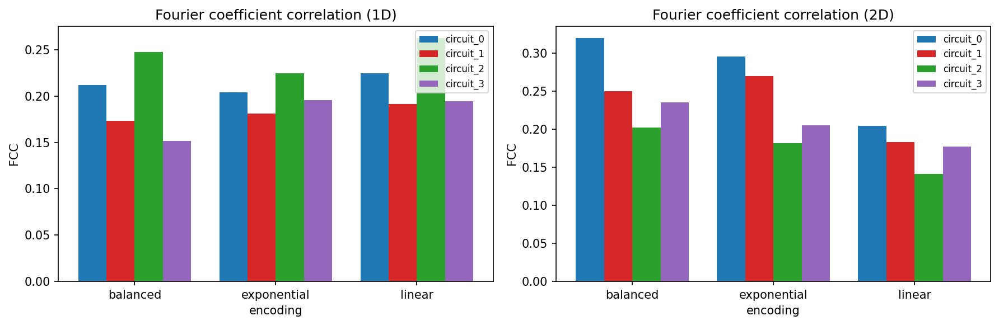
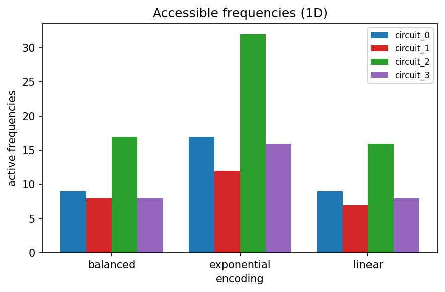
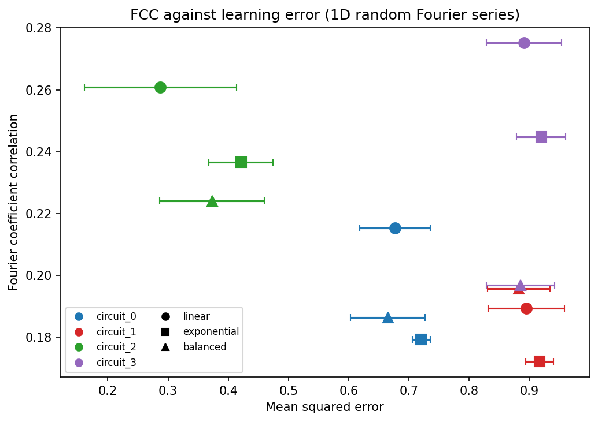

:github_url: https://github.com/merlinquantum/merlin

==============================================
Fourier Fingerprints of Ansatzes in Quantum ML
==============================================

.. admonition:: Paper Information
   :class: note

   **Title**: Fourier Fingerprints of Ansatzes in Quantum Machine Learning

   **Authors**: Melvin Strobl, M. Emre Sahin, Lucas van der Horst, Eileen Kuehn, Achim Streit, Ben Jaderberg

   **Published**: arXiv preprint (2025)

   **DOI**: `10.48550/arXiv.2508.20868 <https://doi.org/10.48550/arXiv.2508.20868>`_

   .. merlin-citations-badge:: fourier_fingerprints

   **Paper URL**: `arXiv:2508.20868 <https://arxiv.org/abs/2508.20868>`_

   **Reproduction Status**: ⚠️ Partial

   **Reproducer**: `@Tancredoss <https://github.com/Tancredoss>`_

Project Repository
==================

.. merlin-gallery::
   :data: _data/galleries/reproduced_papers/fourier_fingerprints_external_links.json
   :columns: 2
   :contour-color: #5648ED

Abstract
========

A quantum model that encodes a classical input and reads out an expectation
value produces a truncated Fourier series in that input. The number of Fourier
basis functions grows exponentially with circuit size, while a model that can
still be trained carries only polynomially many parameters. The coefficients
therefore cannot be set independently: they share parameters, and so they
correlate.

The paper measures those correlations. For many random draws of the ansatz
parameters it computes the Fourier coefficients of the model output, then takes
the Pearson correlation between each pair of frequencies across draws. The
resulting matrix is the *Fourier fingerprint*, and it is characteristic of the
ansatz. Averaging its magnitude gives the Fourier coefficient correlation, or
FCC. The paper reports that ansatzes with lower FCC learn random Fourier series
better, and that the widely used expressibility metric does not rank them
correctly.

Significance
============

The fingerprint is presented as a tool for ansatz selection rather than as a
result about one model. Computing it requires only forward passes at randomly
drawn parameters, so it is cheaper than training every candidate, and the paper
argues it is cheaper than expressibility as well. Carrying the tool to linear
optics makes it available for choosing between photonic circuits, where the
encoding and the interferometer structure both affect the reachable spectrum.

MerLin Implementation
=====================

``lib/fourier.py`` implements the construction for one- and two-dimensional
inputs behind a single ``dimension`` switch. The model uses five optical modes,
four carrying the angle-encoded input and one held as a reference, with two
photons in 1D and three in 2D. Three encodings scale the input before encoding,
and four circuit topologies differ in how trainable entangling layers surround
the encoding.

The measured signal is the probability that mode 0 contains at least one
photon. The relevant Fock states are selected from the layer's own basis
ordering rather than a fixed column range, which keeps the observable correct as
the photon number changes.

``lib/learning.py`` adds the Section 3.1 task: random Fourier targets drawn as
``sqrt(r) exp(-i 2 pi p)`` following the paper's Eq. 7, and a regressor that
wraps the photonic model in a trainable affine read-out head.

Key Contributions Reproduced
============================

**The fingerprint construction and the FCC metric**
  * Implemented the random-parameter sampling, the Fourier transform of the
    measured signal, and the Pearson correlation between frequency pairs.
  * FCC follows the paper's Eq. 5 as the mean absolute off-diagonal correlation.
  * Every dimension, encoding and circuit yields a well-formed fingerprint, with
    FCC between 0.14 and 0.32.

**The effect of the encoding on the reachable spectrum**
  * Swept three encodings across four topologies in both dimensions.
  * Exponential scale factors reach frequencies up to 31 against 15 for a linear
    ramp, and applying the encoding twice widens the spectrum further.

**The Section 3.1 learning task**
  * Trained all four topologies on random Fourier targets, with every circuit
    seeing the same targets so the comparison is paired.
  * Measured whether FCC ranks the resulting error, and identified why it does
    not on this circuit set.

Implementation Details
======================

Runs are launched from the reproduced-papers repository root.

.. code-block:: bash

   # Default configuration
   python implementation.py --paper Fourier_Fingerprints

   # A specific 1D or 2D configuration
   python implementation.py --paper Fourier_Fingerprints --config configs/1D_exp.json
   python implementation.py --paper Fourier_Fingerprints --config configs/2D_exp.json

``utils/summarize_fcc.py`` sweeps every combination and curates the FCC table and
figures. ``utils/fcc_vs_mse.py`` runs the learning study. A notebook walks
through the 1D exponential case.

Experimental Results
====================

The diagnostic on photonic circuits
-----------------------------------

   FCC for every topology and encoding. The tool separates the four circuits
   rather than returning one value for all of them, and the ordering differs
   between one and two dimensions.

The encoding sets the accessible spectrum
-----------------------------------------

   Active frequencies in 1D. The reachable spectrum follows the encoding scale
   factors and the number of encoding layers, not the entangling structure.
   Circuit 2 applies the encoding twice and reaches the most frequencies under
   every encoding.

Does FCC rank the learning error?
---------------------------------

Each circuit was trained on five random Fourier targets per encoding, with all
four circuits seeing the same targets. Targets are standardised to unit
variance, so an MSE of 1.0 is what a constant predictor achieves.

.. list-table:: FCC against learning error, 1D, 5 seeds
   :header-rows: 1
   :widths: 20 18 14 20 12 12

   * - Encoding
     - Circuit
     - FCC
     - MSE
     - Params
     - Active freqs
   * - linear
     - circuit_0
     - 0.2152
     - 0.677 ± 0.059
     - 40
     - 9
   * - linear
     - circuit_1
     - 0.1894
     - 0.895 ± 0.064
     - 12
     - 7
   * - linear
     - circuit_2
     - 0.2609
     - 0.287 ± 0.126
     - 60
     - 16
   * - linear
     - circuit_3
     - 0.2752
     - 0.891 ± 0.062
     - 8
     - 9
   * - exponential
     - circuit_2
     - 0.2366
     - 0.421 ± 0.053
     - 60
     - 31
   * - balanced
     - circuit_2
     - 0.2240
     - 0.373 ± 0.087
     - 60
     - 16

   FCC against learning error. Colour is the circuit topology, marker the
   encoding.

On this circuit set FCC does not rank the error. Spearman coefficients are
-0.40 (linear), +0.20 (exponential) and -0.20 (balanced), and -0.22 pooled,
where the paper's validation gives a positive coefficient.

The reason is capacity. These four topologies carry between 8 and 60 trainable
parameters, and ranking the same twelve points by parameter count gives Spearman
-0.881 against -0.224 for FCC. Two capacity-comparable pairs agree: the two
smallest circuits reach 0.898 and 0.899 mean error although their FCC differs by
28 percent, and between the two largest the higher FCC goes with the lower
error.

This does not contradict the metric. The paper compares ansatzes at fixed qubit
count and comparable size, which is the regime where a structural diagnostic can
show through. Establishing whether FCC selects well among photonic ansatzes
needs a capacity-matched circuit family, which the tool is now in place to
evaluate.

Limitations
===========

* The four topologies span a factor of 7.5 in parameter count, so this set
  cannot isolate the effect the paper describes. A capacity-matched family is
  required before FCC can be called useful or useless for photonic ansatz
  selection.
* Four circuits per encoding is a small basis for a rank correlation. The paper
  compares eight ansatzes.
* The topologies are photonic and have no counterpart among the paper's
  gate-model ansatzes, so no individual FCC value matches a number in the paper.
* The learning study adds a trainable affine read-out head so the circuit's
  probability output can reach the target's range. The head cannot introduce
  frequencies, but the paper trains its model output directly.
* Under exponential encoding the reachable frequencies run to 31 against a
  Nyquist limit of 32 for the 64-point grid, so that setting sits close to the
  resolution of the analysis.
* The paper's Section 3.2 jet-reconstruction application is out of scope.

Code Access and Documentation
=============================

**GitHub Repository**: `merlinquantum/reproduced_papers (Fourier_Fingerprints) <https://github.com/merlinquantum/reproduced_papers/tree/main/papers/Fourier_Fingerprints>`_

Citation
========

.. code-block:: bibtex

   @misc{strobl_fourier_2025,
     title={Fourier Fingerprints of Ansatzes in Quantum Machine Learning},
     author={Strobl, Melvin and Sahin, M. Emre and van der Horst, Lucas and Kuehn, Eileen and Streit, Achim and Jaderberg, Ben},
     year={2025},
     eprint={2508.20868},
     archivePrefix={arXiv},
     primaryClass={quant-ph},
     doi={10.48550/arXiv.2508.20868}
   }

Related Reproductions
=====================

* :doc:`data_reuploading` studies how repeated encoding widens the accessible
  frequency spectrum, the mechanism behind the encoding result above.
* :doc:`BP_QNN` covers barren plateaus, the other structural diagnostic commonly
  used for ansatz selection.
