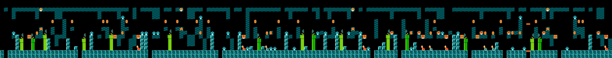
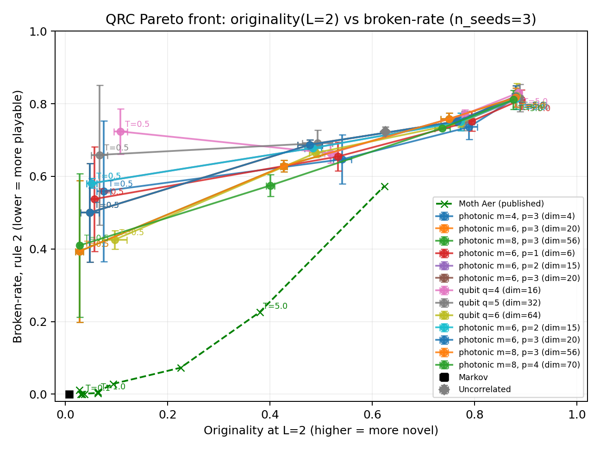

:github_url: https://github.com/merlinquantum/merlin

=================================================
Level Generation with Quantum Reservoir Computing
=================================================

.. admonition:: Paper Information
   :class: note

   **Title**: Level Generation with Quantum Reservoir Computing

   **Authors**: João S. Ferreira, Pierre Fromholz, Hari Shaji, James R. Wootton

   **Published**: IEEE Computer Graphics and Applications (2025)

   **DOI**: `10.1109/MCG.2025.3591956 <https://doi.org/10.1109/MCG.2025.3591956>`_

   .. merlin-citations-badge:: qrc_level_generation

   **Paper URL**: `arXiv:2505.13287 <https://arxiv.org/abs/2505.13287>`_

   **Reproduction Status**: ⚠️ Partial

   **Reproducer**: Benjamin Stott

Project Repository
==================

.. merlin-gallery::
   :data: _data/galleries/reproduced_papers/qrc_level_generation_external_links.json
   :columns: 2
   :contour-color: #5648ED

Abstract
========

The paper applies quantum reservoir computing to procedural game-level
generation. A reservoir of 4 to 8 qubits consumes a sequence of integer feature
indices encoding level columns, and a classical feed-forward network maps the
measured probability vector to a next-feature distribution. Sampling at
temperature *T* controls how far generated levels depart from the original. Two
metrics are introduced: the originality rate at sequence length *L*, defined as
the fraction of length-*L* windows in generated samples absent from the original
level, and the broken-transition rate, defined as the fraction of positions
violating a hand-specified game rule. An i.i.d. generator and an empirical Markov
chain serve as baselines. The paper evaluates a Super Mario Bros level on ideal
and noisy backends, and a Roblox obby generated in real time on superconducting
hardware.

Significance
============

The reservoir is frozen, so the temperature parameter adjusts the balance between
originality and playability after training without any further optimisation.
That property transfers directly to linear-optical hardware, where a fixed random
interferometer is the natural primitive. The reproduction therefore tests both
the paper's metric definitions and whether the temperature behaviour survives a
photonic reservoir.

MerLin Implementation
=====================

Both backends share one generation pipeline. ``lib/qrc_qubit.py`` implements the
gate-based reservoir with an optional depolarising channel.
``lib/qrc_photonic.py`` implements a MerLin photonic reservoir: an entangling MZI
mesh, an ``add_angle_encoding`` layer and further entangling layers, with
randomly initialised parameters held fixed. ``lib/qrc_pipeline.py`` provides
teacher forcing and autoregressive generation for both, ``lib/metrics.py`` the
originality, broken-rate and save-point statistics, and ``lib/baselines.py`` the
Markov and i.i.d. reference generators.

The photonic reservoir uses the ``UNBUNCHED`` computation space with 6 modes and
3 photons, giving an output dimension of 20 against 64 for a 6-qubit register.

Key Contributions Reproduced
============================

**Metric definitions validated against the released sequences**
  * Computed originality, broken-rate and save-point statistics on the authors'
    published Aer sequences, independently of any reservoir.
  * Measured a 2.8% broken rate at *T* = 2, against the paper's statement that the
    error rate stays below 5% up to *T* = 2.

**Save-point separation reproduced exactly**
  * Established by sweeping every feature index that the paper's save-point table
    refers to the Roblox obby rather than to Mario, with feature index 11 as the
    save point.
  * With that mapping the paper's table reproduces across all five qubit counts.

**Temperature behaviour on trained reservoirs**
  * Trained gate-based and photonic reservoirs and confirmed that originality and
    broken-rate rise monotonically with *T* in both.
  * The operating point is shifted along the temperature axis relative to the
    paper.

**Photonic scaling study**
  * Swept mode count, photon number and output dimension at three seeds.
  * At matched output dimension the photonic reservoir is competitive with the
    gate-based one, and at the largest size tested attains lower originality and
    broken-rate.

Implementation Details
======================

Runs are launched from the reproduced-papers repository root. The reservoir is
CPU-only. The Mario qubit reproduction completes in under a minute and the
photonic variant in under three.

.. code-block:: bash

   # Metrics on the authors' published sequences, no training
   python implementation.py --paper qrc_level_generation --config configs/reference_eval.json

   # Gate-based QRC, temperature sweep, ideal simulator
   python implementation.py --paper qrc_level_generation --config configs/mario_qubit_paper.json

   # MerLin photonic reservoir
   python implementation.py --paper qrc_level_generation --config configs/mario_photonic.json

The original level sequence and the reference sequences are taken from the Moth
Quantum open-data release for this paper.

Experimental Results
====================

Metrics on the published sequences
----------------------------------

.. list-table:: Originality and broken rate on the released Aer sequences (6 qubits)
   :header-rows: 1
   :widths: 25 25 25 25

   * - Temperature
     - L=2 originality
     - L=10 originality
     - Broken rate (rule "2")
   * - 0.1
     - 0.033
     - 0.567
     - 0.000
   * - 1.0
     - 0.063
     - 0.695
     - 0.003
   * - 2.0
     - 0.093
     - 0.836
     - 0.028
   * - 5.0
     - 0.380
     - 0.992
     - 0.226
   * - 30.0
     - 0.849
     - 1.000
     - 0.793

Save-point separation
---------------------

.. list-table:: Save-point separation, Aer, β = 1, 100 samples, feature index 11
   :header-rows: 1
   :widths: 20 40 40

   * - Qubits
     - Reproduction
     - Paper
   * - 4
     - 17.93 ± 7.92
     - 17.9 ± 7.9
   * - 5
     - 16.34 ± 2.97
     - 16.3 ± 2.9
   * - 6
     - 18.81 ± 4.13
     - 18.8 ± 4.1
   * - 7
     - 18.62 ± 3.53
     - 18.6 ± 3.5
   * - 8
     - 17.14 ± 4.17
     - 17.1 ± 4.1

Trained reservoirs
------------------

At *T* = 1 the trained gate reservoir reaches L=2 originality 0.340 and the
photonic reservoir 0.274, against 0.063 for the published sequences. The
qualitative temperature behaviour is preserved in both. The offset is consistent
with reservoir-specific calibration: different random reservoirs produce logit
distributions of different scale, which the temperature parameter absorbs.

.. figure:: ../../_static/reproduced_papers/qrc_level_generation/level_qrc_T1.png
   :alt: A Super Mario Bros level generated by the reproduced 6-qubit reservoir at temperature 1
   :align: center
   :width: 95%

   Reproduced 6-qubit reservoir at *T* = 1: continuous ground and coherent pipe
   placement.

   The same model at *T* = 30, in the broken-transition regime.

Photonic scaling
----------------

.. list-table:: Iso-output-dimension comparison at T = 1 (3 seeds)
   :header-rows: 1
   :widths: 30 12 20 20 18

   * - Backend
     - Dim
     - Originality L=2
     - Broken rate "2"
     - Final CE loss
   * - photonic m=6, p=2
     - 15
     - 0.484 ± 0.016
     - 0.678 ± 0.006
     - 1.93
   * - qubit q=4
     - 16
     - 0.518 ± 0.011
     - 0.664 ± 0.027
     - 1.72
   * - photonic m=6, p=3
     - 20
     - 0.478 ± 0.024
     - 0.687 ± 0.013
     - 1.89
   * - qubit q=5
     - 32
     - 0.493 ± 0.029
     - 0.691 ± 0.036
     - 1.59
   * - photonic m=8, p=3
     - 56
     - 0.427 ± 0.006
     - 0.628 ± 0.016
     - 1.73
   * - qubit q=6
     - 64
     - 0.489 ± 0.013
     - 0.665 ± 0.013
     - 1.38
   * - photonic m=8, p=4
     - 70
     - 0.401 ± 0.008
     - 0.575 ± 0.030
     - 1.73

The photonic reservoir at dimension 70 attains the lowest originality and
broken-rate of the configurations tested, despite a higher training-loss floor
than the gate reservoir at dimension 64. Training-set fit and generation quality
are therefore not aligned across reservoir families.

   Originality against broken-rate, parametric in *T*, all configurations
   overlaid.

Hardware-Aware Settings
=======================

.. list-table:: MerLin reservoir
   :header-rows: 1
   :widths: 40 60

   * - Field
     - Value
   * - Computation space
     - ``UNBUNCHED``
   * - Detector model
     - threshold
   * - Photon number
     - 3
   * - Number of modes
     - 6
   * - Input state
     - ``[0, 1, 0, 1, 1, 0]``
   * - Encoding
     - angle, all 6 modes, scale ``π``
   * - Measurement strategy
     - ``MeasurementStrategy.probs(computation_space=UNBUNCHED)``
   * - Postselection
     - none
   * - Simulator
     - MerLin CPU simulator (analytic, shots = 0)
   * - Wall-clock
     - 2.5 min
   * - Seeds
     - 42

For a frozen linear-optical reservoir, consecutive passive meshes with no data
injection or nonlinearity between them compose into a single equivalent
interferometer, so post-encoding depth changes only which random unitary is
drawn. A controlled comparison at one and two post-encoding layers confirms this:
every metric agrees to within single-seed noise.

Limitations
===========

* The paper does not specify gate counts, angle conventions or the map from
  one-hot input and hidden state to rotation angles. The reproduction uses 30
  random gates per reservoir, a per-feature angle book sampled from ``U(-π, π)``
  and a Gaussian random projection from the hidden state to the rotation angles.
  These choices shift the operating point in temperature space.
* Depolarising noise is applied once per step as a global channel rather than per
  gate, which changes the effective noise budget. The resulting
  originality-against-noise curve at *T* = 1 is not monotonic.
* The FakeGarnet noise model is not implemented, as it requires IQM calibration
  data. Metrics on the published FakeGarnet sequences are computed in
  reference-only mode.
* The Roblox obby experiments are out of scope. The open-data release contains
  feature images but no level definitions, and the authors' Roblox encoder is not
  released.
* The feed-forward read-out is a single linear layer trained for 200 epochs. The
  paper does not specify its width or training schedule.

Code Access and Documentation
=============================

**GitHub Repository**: `merlinquantum/reproduced_papers (qrc_level_generation) <https://github.com/merlinquantum/reproduced_papers/tree/main/papers/qrc_level_generation>`_

The reproduction includes a level renderer that rebuilds the tile atlas from the
packaged level image and sequence and verifies it against every column. No Roblox
feature art is redistributed.

Citation
========

.. code-block:: bibtex

   @article{ferreira_level_2025,
     title={Level Generation with Quantum Reservoir Computing},
     author={Ferreira, Jo{\~a}o S. and Fromholz, Pierre and Shaji, Hari and Wootton, James R.},
     journal={IEEE Computer Graphics and Applications},
     year={2025},
     doi={10.1109/MCG.2025.3591956}
   }

Related Reproductions
=====================

* :doc:`quantum_reservoir_computing` covers quantum optical reservoir computing
  powered by boson sampling, applying a photonic reservoir to classification.
