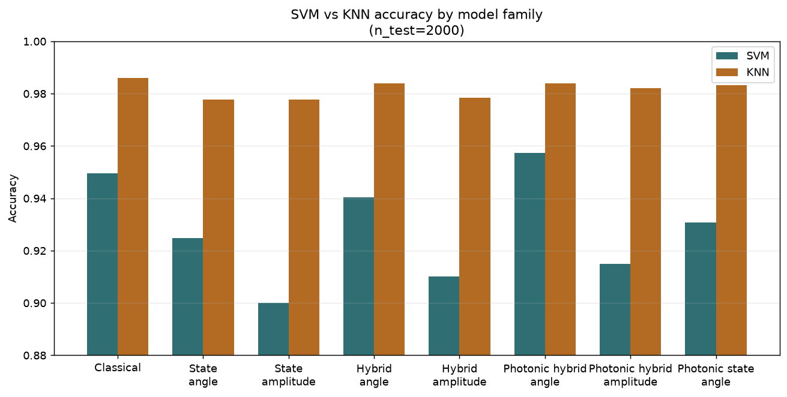
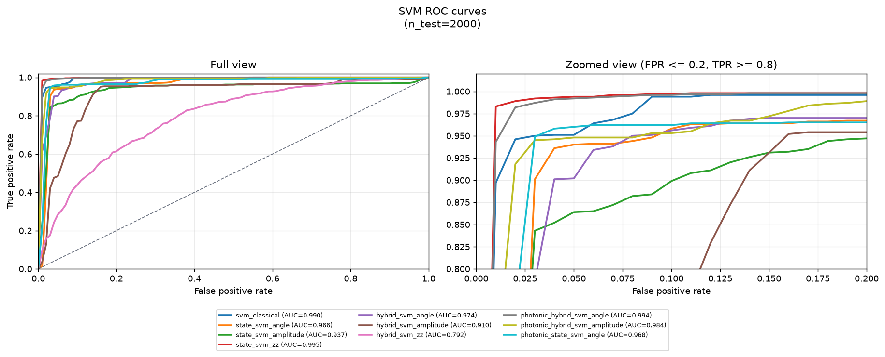
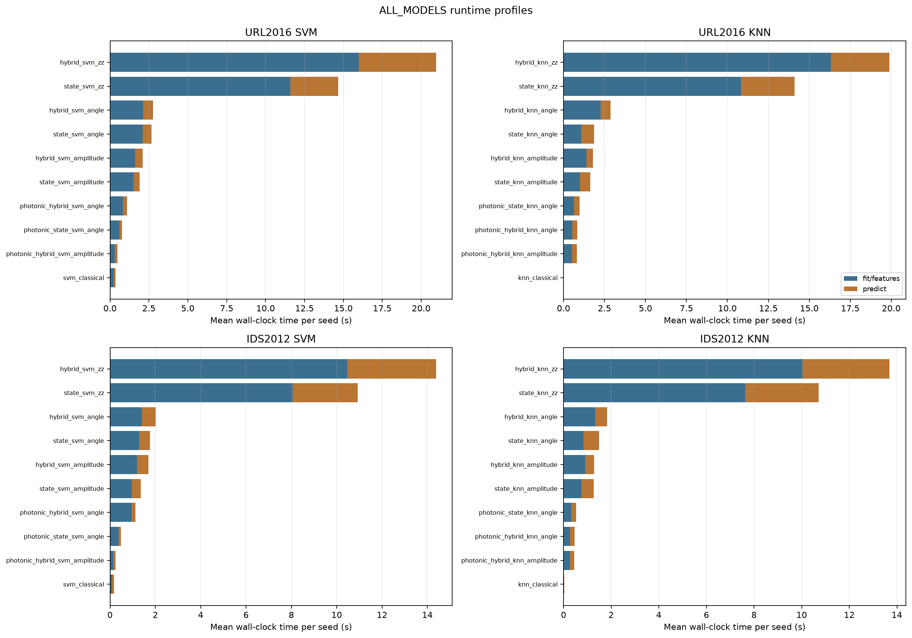

:github_url: https://github.com/merlinquantum/merlin

=================================================================
Encrypted Network Traffic Analysis Using Quantum Machine Learning
=================================================================

.. admonition:: Paper Information
   :class: note

   **Title**: Encrypted network traffic analysis using quantum machine learning

   **Authors**: Gokul Sunil Sodar, Akshay Murthy, Annapurna Jonnalagadda, Aswani Kumar Cherukuri

   **Published**: EPJ Quantum Technology (2026)

   **DOI**: `10.1140/epjqt/s40507-025-00459-7 <https://doi.org/10.1140/epjqt/s40507-025-00459-7>`_

   .. merlin-citations-badge:: qsvm_qknn

   **Reproduction Status**: ⚠️ Partial

   **Reproducer**: Vincent Espitalier

Project Repository
==================

.. merlin-gallery::
   :data: _data/galleries/reproduced_papers/qsvm_qknn_external_links.json
   :columns: 2
   :contour-color: #5648ED

Abstract
========

The paper classifies encrypted network traffic as benign or malicious on two
CIC ISCX datasets, URL2016 and IDS2012, and compares three model families
against each other: classical SVM and KNN, pure quantum QSVM and QKNN built on
fidelity kernels, and hybrid pipelines where a quantum circuit produces features
that a classical SVM or KNN then classifies. Angle and amplitude encodings are
both tested. The reported finding is that quantum and hybrid variants are
broadly comparable to the classical baselines, that hybrids generally beat
purely quantum variants, and that pure quantum models are substantially slower
on state-vector simulators.

Significance
============

The interesting quantity here is not accuracy but where the quantum circuit
sits in the pipeline. A fidelity-kernel QSVM evaluates the circuit once per pair
of samples, so cost grows quadratically with dataset size. A hybrid model
evaluates it once per sample and hands fixed features to a classical
classifier, which is linear. The paper's practical argument is that the hybrid
arrangement is the deployable one under current hardware, and that argument is
testable independently of whether quantum helps at all.

MerLin Implementation
=====================

The gate-based reproduction uses PennyLane for the ten model variants the paper
compares. Two sets of additions sit alongside it.

``lib/encoders.py`` adds a non-trainable ZZ feature map, because plain angle
encoding is largely component-wise and carries little entangling structure. The
ZZ variants provide a richer gate-based point of comparison for the photonic
maps.

The MerLin extension uses fixed photonic reservoirs under the same SVM and KNN
protocol, with four variants on each side:

.. list-table:: Photonic variants
   :header-rows: 1
   :widths: 34 16 28 22

   * - Variant
     - Encoding
     - Readout or kernel
     - Classical step
   * - ``photonic_hybrid_svm_angle`` / ``_amplitude``
     - angle / amplitude
     - reservoir probability features
     - RBF SVM
   * - ``photonic_state_svm_angle``
     - angle
     - explicit state-fidelity Gram matrix
     - precomputed-kernel SVM
   * - ``photonic_fidelity_svm_angle``
     - angle
     - MerLin ``FidelityKernel``
     - precomputed-kernel SVM
   * - ``photonic_hybrid_knn_angle`` / ``_amplitude``
     - angle / amplitude
     - reservoir probability features
     - Euclidean KNN
   * - ``photonic_state_knn_angle``
     - angle
     - explicit ``1 - fidelity`` distances
     - KNN

The ``state_*`` variants compute state amplitudes once and form fidelity kernels
explicitly, which avoids the pairwise circuit evaluations that make the legacy
``FidelityKernel`` path quadratic.

Key Contributions Reproduced
============================

**The model comparison**
  * Implemented all ten gate-based variants the paper compares, across angle and
    amplitude encodings, on both datasets.
  * Reproduced the comparison structure on matched balanced splits, with the
    paper's undersampling policy mirrored in the loader.

**Encoding sensitivity**
  * Confirmed that the encoding ordering is not stable: angle, amplitude, ZZ and
    photonic maps reorder across datasets and across SVM versus KNN.

**Runtime accounting**
  * Reproduced the practical claim that fidelity-kernel models are slow, and
    quantified where the cost sits.

**Photonic and ZZ extensions**
  * Added photonic reservoir feature maps and a ZZ feature map under the same
    protocol, so gate-based and photonic encodings are compared on equal terms.

**Fair baselines**
  * Every comparison carries the matching classical model on the same cleaned,
    balanced split and the same retained features.

Implementation Details
======================

.. code-block:: bash

   # Synthetic smoke run, no CIC CSV files required
   python implementation.py --paper qSVM_qKNN

   # A curated configuration
   python implementation.py --paper qSVM_qKNN --config configs/fast_models_url2016.json

The CIC ISCX datasets are not redistributed. Results are curated under
``results/`` as aggregate tables plus per-configuration folders holding
summaries, plots, timings, ROC data and prediction-agreement artifacts.

Experimental Results
====================

Best accuracy per family and dataset. Full per-model metrics, standard
deviations and timings are in the reproduction's result folders.

.. list-table:: Best SVM and KNN accuracy per configuration family
   :header-rows: 1
   :widths: 24 14 31 31

   * - Config family
     - Dataset
     - Best SVM
     - Best KNN
   * - Original gate-based
     - IDS2012
     - ``svm_classical`` 0.9920
     - ``knn_classical`` 0.9960
   * - Original gate-based
     - URL2016
     - ``svm_classical`` 0.9465
     - ``knn_classical`` 0.9850
   * - All models
     - IDS2012
     - ``state_svm_zz`` 0.9845
     - ``knn_classical`` 0.9900
   * - All models
     - URL2016
     - ``state_svm_zz`` 0.9570
     - ``knn_classical`` 0.9740
   * - Fast models
     - IDS2012
     - ``photonic_hybrid_svm_angle`` 0.9908 ± 0.0013
     - ``knn_classical`` 0.9937 ± 0.0010
   * - Fast models
     - URL2016
     - ``photonic_hybrid_svm_angle`` 0.9573 ± 0.0038
     - ``knn_classical`` 0.9860 ± 0.0008
   * - MerLin
     - IDS2012
     - ``photonic_hybrid_svm_amplitude`` 0.9910
     - ``photonic_hybrid_knn_angle`` 0.9950
   * - MerLin
     - URL2016
     - ``photonic_hybrid_svm_angle`` 0.9835
     - ``photonic_hybrid_knn_amplitude`` 0.9945

   Fast-model comparison on URL2016. Photonic hybrid variants sit alongside the
   classical baselines rather than apart from them.

Two patterns hold across the curated runs.

**The classical baseline is never beaten by a wide margin.** On every family and
dataset the best model is within about one percentage point of the corresponding
classical SVM or KNN, and in the original gate-based family the classical model
is itself the best on both datasets. The paper's claim of broad comparability
reproduces; a claim of advantage would not.

**KNN is the stronger and more stable family here.** KNN variants keep high
accuracy with less sensitivity to the encoder. Since the backbones are fixed and
KNN trains no classifier parameters, it is less exposed to classifier-level
overfitting on the small balanced splits used.

   ROC curves across all SVM variants on IDS2012. The variants are hard to
   separate, which is the substance of the comparability claim.

   Runtime across variants. The gap between fidelity-kernel models and explicit
   feature or state-fidelity models is the paper's practical argument for
   hybrids, and it reproduces clearly.

Limitations
===========

* Paper-scale metrics are not claimed. Several runs are bounded by row or
  feature ablations to fit the runtime budget, so the comparison structure
  reproduces but absolute numbers are not matched to the paper's tables.
* The CIC ISCX datasets are not redistributed with the reproduction and must be
  obtained separately.
* Legacy ``FidelityKernel`` variants scale quadratically in evaluated samples,
  which is why the larger configurations use the explicit state-fidelity and
  explicit-feature paths instead.
* The ZZ feature map and the photonic reservoirs are additions, not part of the
  paper, and are labelled as such.
* Encoding choice does not carry a stable ordering across datasets or model
  families, so per-encoding conclusions should not be generalised.

Code Access and Documentation
=============================

**GitHub Repository**: `merlinquantum/reproduced_papers (qSVM_qKNN) <https://github.com/merlinquantum/reproduced_papers/tree/main/papers/qSVM_qKNN>`_

Citation
========

.. code-block:: bibtex

   @article{sodar_encrypted_2026,
     title={Encrypted network traffic analysis using quantum machine learning},
     author={Sodar, Gokul Sunil and Murthy, Akshay and Jonnalagadda, Annapurna and Cherukuri, Aswani Kumar},
     journal={EPJ Quantum Technology},
     year={2026},
     doi={10.1140/epjqt/s40507-025-00459-7}
   }

Related Reproductions
=====================

* :doc:`photonic_kernel` compares photonic kernels built from indistinguishable
  and distinguishable photons, a complementary view of what a photonic feature
  map contributes.
* :doc:`nearest_centroids` applies amplitude encoding to a distance-based
  classifier, the same family as the KNN variants here.
